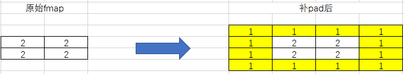

# torch_npu.contrib.module.QuantConv2d

## 功能说明

QuantConv2d是对torch_npu.npu_quant_conv2d接口的封装类，为用户提供Conv2d算子量化相关功能，实现的计算公式如下：


## 函数原型

```
torch_npu.contrib.module.QuantConv2d(in_channels, out_channels, kernel_size, output_dtype, stride=1, padding=0, dilation=1, groups=1, bias=True, offset=False, offset_x=0, round_mode="rint", device=None, dtype=None)
```

## 参数说明

- in_channels：int类型，必选参数，Conv2d的输入的channel值。
- out_channels：int类型，必选参数，Conv2d的输出的channel值。
- kernel_size：int或者tuple类型，必选参数，卷积核大小，支持单个数字输入或者2维tuple输入。当前仅支持kernel_size范围为[1, 255]。
- output_dtype：torch.dtype类型，必选参数，输出数据类型，当前仅支持输入torch.float16。
- stride：int或者tuple类型，可选参数，默认值为1，Conv2d的stride，支持单个数字输入或者2维tuple输入。当前仅支持stride范围为[1, 63]。
- padding：int或者tuple类型，可选参数，默认值为0，Conv2d的padding，支持单个数字输入或者2维tuple输入。当前仅支持padding范围为[0, 255]。
- dilation：int或者tuple类型，可选参数，默认值为1，Conv2d的dilation，支持单个数字输入或者2维tuple输入。当前仅支持dilation范围为[1, 255]。
- groups：int类型，可选参数，默认值为1，Conv2d的group。当前仅支持取1。
- bias：bool类型，可选参数，默认值为True，代表是否需要bias计算参数。如果设置成False，则bias不会加入QuantConv2d计算。
- offset：bool类型，可选参数，默认值为False，**预留参数，暂未使用**。
- offset_x：int类型，可选参数，默认值为0，补的pad中填入的实际值。

     示例：如果padding为[1,1]，offset_x为1，fmap变化如图所示：

    

- round_mode：str类型，可选参数，默认值为"rint"。**预留参数，暂未使用**。
- device：可选参数，默认值为None。**预留参数，暂未使用**。
- dtype：可选参数，默认值为None。**预留参数，暂未使用**。

## 输入说明

quant_conv2d_input（计算输入）：Tensor类型，数据类型支持int8，数据格式支持NCHW，shape为4维。

## 变量说明

- weight：Tensor类型，数据格式支持int8。数据格式支持NCHW，shape为4维。
- scale：Tensor类型，数据类型支持float32和int64。数据格式支持ND，shape是1维(n,)，其中n与weight的out_channels一致。
- bias：Tensor类型，可选参数。数据类型支持int32，数据格式支持ND，shape支持1维(n,)，n与weight的out_channels一致。

## 输出说明

一个Tensor类型的输出，代表QuantConv2d的计算结果：

- 如果output_dtype为float16，输出的数据类型为float16。
- 如果output_dtype非以上数据类型，则不支持。

## 约束说明

- 该接口支持推理场景下使用。
- 该接口仅支持PyTorch静态图模式在线推理（目前仅支持PyTorch 2.1版本）。
- <term>Atlas 推理系列产品</term>：不支持output中w轴为1的场景。

## 支持的型号

- <term>Atlas A2 训练系列产品/Atlas 800I A2 推理产品/A200I A2 Box 异构组件</term> 
- <term>Atlas A3 训练系列产品/Atlas A3 推理系列产品</term> 
- <term>Atlas 推理系列产品</term> 

## 调用示例

图模式调用：

```python
import torch
import torch_npu
import torchair as tng

from torchair.configs.compiler_config import CompilerConfig
from torch_npu.contrib.module import QuantConv2d


torch_npu.npu.set_device(0)
config = CompilerConfig()
npu_backend = tng.get_npu_backend(compiler_config=config)

fmap = torch.randint(-1, 1, (1, 1, 64, 64), dtype=torch.int8).npu()
weight = torch.randint(-1, 1, (1, 1, 3, 3), dtype=torch.int8).npu()
scale = torch.rand((1,), dtype=torch.float32).npu()
bias = torch.randint(-1, 1, (1,), dtype=torch.int32).npu()

model = QuantConv2d(in_channels=1, out_channels=1, kernel_size=(3, 3), output_dtype=torch.float16).npu()
model.weight.data = weight
model.scale.data = scale
model.bias.data = bias

with torch.no_grad():
    static_graph_model = torch.compile(model, backend=npu_backend, dynamic=False)
    output = static_graph_model(fmap)
print("static graph result: ", output)
```

