# torch\_npu.npu\_fusion\_attention<a name="ZH-CN_TOPIC_0000002266361349"></a>

## 功能说明<a name="zh-cn_topic_0000001742717129_section14441124184110"></a>

实现“Transformer Attention Score”的融合计算，实现的计算公式如下：


## 函数原型<a name="zh-cn_topic_0000001742717129_section45077510411"></a>

```
torch_npu.npu_fusion_attention(Tensor query, Tensor key, Tensor value, int head_num, str input_layout, Tensor? pse=None, Tensor? padding_mask=None, Tensor? atten_mask=None, float scale=1., float keep_prob=1., int pre_tockens=2147483647, int next_tockens=2147483647, int inner_precise=0, int[]? prefix=None, int[]? actual_seq_qlen=None, int[]? actual_seq_kvlen=None, int sparse_mode=0, bool gen_mask_parallel=True, bool sync=False) -> (Tensor, Tensor, Tensor, Tensor, int, int, int)
```

## 参数说明<a name="zh-cn_topic_0000001742717129_section112637109429"></a>

-   query：Tensor类型，数据类型支持float16、bfloat16、float32，数据格式支持ND。综合约束请见[约束说明](#zh-cn_topic_0000001742717129_section12345537164214)。
-   key：Tensor类型，数据类型支持float16、bfloat16、float32，数据格式支持ND。综合约束请见[约束说明](#zh-cn_topic_0000001742717129_section12345537164214)。
-   value：Tensor类型，数据类型支持float16、bfloat16、float32，数据格式支持ND。综合约束请见[约束说明](#zh-cn_topic_0000001742717129_section12345537164214)。
-   head\_num：int类型，代表head个数，数据类型支持int64。综合约束请见[约束说明](#zh-cn_topic_0000001742717129_section12345537164214)。
-   input\_layout：string类型，代表输入query、key、value的数据排布格式，支持BSH、SBH、BSND、BNSD、TND（actual\_seq\_qlen/actual\_seq\_kvlen需传值，input_layout为TND时即为varlen场景）；后续章节如无特殊说明，S表示query或key、value的sequence length，Sq表示query的sequence length，Skv表示key、value的sequence length，SS表示Sq\*Skv。
-   pse：Tensor类型，可选参数，表示位置编码。数据类型支持float16、bfloat16、float32，数据格式支持ND。非varlen场景支持四维输入，包含BNSS格式、BN1Skv格式、1NSS格式。如果非varlen场景Sq大于1024或varlen场景、每个batch的Sq与Skv等长且是sparse\_mode为0、2、3的下三角掩码场景，可使能alibi位置编码压缩，此时只需要输入原始PSE最后1024行进行内存优化，即alibi\_compress = ori\_pse\[:, :, -1024:, :\]，参数每个batch不相同时，输入BNHSkv\(H=1024\)，每个batch相同时，输入1NHSkv\(H=1024\)。
-   padding\_mask：Tensor类型，**暂不支持该传参**。
-   atten\_mask：Tensor类型，可选参数，取值为1代表该位不参与计算（不生效），为0代表该位参与计算，数据类型支持bool、uint8，数据格式支持ND，输入shape类型支持BNSS格式、B1SS格式、11SS格式、SS格式。varlen场景只支持SS格式，SS分别是maxSq和maxSkv。综合约束请见[约束说明](#zh-cn_topic_0000001742717129_section12345537164214)。
-   scale：浮点型，可选参数，代表缩放系数，作为计算流中Muls的scalar值，数据类型支持float，默认值为1。
-   keep\_prob：浮点型，可选参数，代表Dropout中1的比例，取值范围为\(0, 1\] 。数据类型支持float，默认值为1，表示全部保留。
-   pre\_tockens：整型，用于稀疏计算的参数，可选参数，数据类型支持int64，默认值为2147483647。综合约束请见[约束说明](#zh-cn_topic_0000001742717129_section12345537164214)。
-   next\_tockens：整型，用于稀疏计算的参数，可选参数，数据类型支持int64，默认值为2147483647。next\_tockens和pre\_tockens取值与atten\_mask的关系请参见sparse\_mode参数，参数取值与atten\_mask分布不一致会导致精度问题。综合约束请见[约束说明](#zh-cn_topic_0000001742717129_section12345537164214)。
-   inner\_precise：整型，用于提升精度，数据类型支持int64，默认值为0。

    >**说明：**<br>
    >当前0、1为保留配置值，2为使能无效行计算，其功能是避免在计算过程中存在整行mask进而导致精度有损失，但是该配置会导致性能下降。
    >如果算子可判断出存在无效行场景，会自动使能无效行计算，例如sparse\_mode为3，Sq \> Skv场景。

-   prefix：int类型数组，可选参数，代表prefix稀疏计算场景每个Batch的N值。数据类型支持int64，数据格式支持ND。综合约束请见[约束说明](#zh-cn_topic_0000001742717129_section12345537164214)。
-   actual\_seq\_qlen：int类型数组，可选参数，varlen场景时需要传入此参数。表示query每个S的累加和长度，数据类型支持int64，数据格式支持ND。综合约束请见[约束说明](#zh-cn_topic_0000001742717129_section12345537164214)。

    比如真正的S长度列表为：2 2 2 2 2，则actual\_seq\_qlen传：2 4 6 8 10。

-   actual\_seq\_kvlen：int类型数组，可选参数，varlen场景时需要传入此参数。表示key/value每个S的累加和长度。数据类型支持int64，数据格式支持ND。综合约束请见[约束说明](#zh-cn_topic_0000001742717129_section12345537164214)。

    比如真正的S长度列表为：2 2 2 2 2，则actual\_seq\_kvlen传：2 4 6 8 10。

-   sparse\_mode：整型，表示sparse的模式，可选参数，默认值为0。取值如[表1](#zh-cn_topic_0000001742717129_table1946917414436)所示，不同模式的原理参见[参考资源](#zh-cn_topic_0000001742717129_section28169228374)。当整网的atten\_mask都相同且shape小于2048\*2048时，建议使用defaultMask模式，来减少内存使用量。综合约束请见[约束说明](#zh-cn_topic_0000001742717129_section12345537164214)。

    **表1** sparse\_mode不同取值场景说明

    <a name="zh-cn_topic_0000001742717129_table1946917414436"></a>
    <table><thead align="left"><tr id="zh-cn_topic_0000001742717129_row84694414435"><th class="cellrowborder" valign="top" width="18.001800180018%" id="mcps1.2.4.1.1"><p id="zh-cn_topic_0000001742717129_p174691404320"><a name="zh-cn_topic_0000001742717129_p174691404320"></a><a name="zh-cn_topic_0000001742717129_p174691404320"></a>sparse_mode</p>
    </th>
    <th class="cellrowborder" valign="top" width="45.324532453245325%" id="mcps1.2.4.1.2"><p id="zh-cn_topic_0000001742717129_p114691045439"><a name="zh-cn_topic_0000001742717129_p114691045439"></a><a name="zh-cn_topic_0000001742717129_p114691045439"></a>含义</p>
    </th>
    <th class="cellrowborder" valign="top" width="36.67366736673668%" id="mcps1.2.4.1.3"><p id="zh-cn_topic_0000001742717129_p194697418436"><a name="zh-cn_topic_0000001742717129_p194697418436"></a><a name="zh-cn_topic_0000001742717129_p194697418436"></a>备注</p>
    </th>
    </tr>
    </thead>
    <tbody><tr id="zh-cn_topic_0000001742717129_row946924164313"><td class="cellrowborder" valign="top" width="18.001800180018%" headers="mcps1.2.4.1.1 "><p id="zh-cn_topic_0000001742717129_p8469144184316"><a name="zh-cn_topic_0000001742717129_p8469144184316"></a><a name="zh-cn_topic_0000001742717129_p8469144184316"></a>0</p>
    </td>
    <td class="cellrowborder" valign="top" width="45.324532453245325%" headers="mcps1.2.4.1.2 "><p id="zh-cn_topic_0000001742717129_p146910414313"><a name="zh-cn_topic_0000001742717129_p146910414313"></a><a name="zh-cn_topic_0000001742717129_p146910414313"></a>defaultMask模式。</p>
    </td>
    <td class="cellrowborder" valign="top" width="36.67366736673668%" headers="mcps1.2.4.1.3 "><p id="zh-cn_topic_0000001742717129_p44691142433"><a name="zh-cn_topic_0000001742717129_p44691142433"></a><a name="zh-cn_topic_0000001742717129_p44691142433"></a>-</p>
    </td>
    </tr>
    <tr id="zh-cn_topic_0000001742717129_row1446911419433"><td class="cellrowborder" valign="top" width="18.001800180018%" headers="mcps1.2.4.1.1 "><p id="zh-cn_topic_0000001742717129_p164691416431"><a name="zh-cn_topic_0000001742717129_p164691416431"></a><a name="zh-cn_topic_0000001742717129_p164691416431"></a>1</p>
    </td>
    <td class="cellrowborder" valign="top" width="45.324532453245325%" headers="mcps1.2.4.1.2 "><p id="zh-cn_topic_0000001742717129_p146904204320"><a name="zh-cn_topic_0000001742717129_p146904204320"></a><a name="zh-cn_topic_0000001742717129_p146904204320"></a>allMask模式。</p>
    </td>
    <td class="cellrowborder" valign="top" width="36.67366736673668%" headers="mcps1.2.4.1.3 "><p id="zh-cn_topic_0000001742717129_p20469174194319"><a name="zh-cn_topic_0000001742717129_p20469174194319"></a><a name="zh-cn_topic_0000001742717129_p20469174194319"></a>-</p>
    </td>
    </tr>
    <tr id="zh-cn_topic_0000001742717129_row15469194124313"><td class="cellrowborder" valign="top" width="18.001800180018%" headers="mcps1.2.4.1.1 "><p id="zh-cn_topic_0000001742717129_p04691048436"><a name="zh-cn_topic_0000001742717129_p04691048436"></a><a name="zh-cn_topic_0000001742717129_p04691048436"></a>2</p>
    </td>
    <td class="cellrowborder" valign="top" width="45.324532453245325%" headers="mcps1.2.4.1.2 "><p id="zh-cn_topic_0000001742717129_p24691441430"><a name="zh-cn_topic_0000001742717129_p24691441430"></a><a name="zh-cn_topic_0000001742717129_p24691441430"></a>leftUpCausal模式。</p>
    </td>
    <td class="cellrowborder" valign="top" width="36.67366736673668%" headers="mcps1.2.4.1.3 "><p id="zh-cn_topic_0000001742717129_p16469134124314"><a name="zh-cn_topic_0000001742717129_p16469134124314"></a><a name="zh-cn_topic_0000001742717129_p16469134124314"></a>-</p>
    </td>
    </tr>
    <tr id="zh-cn_topic_0000001742717129_row1946915417431"><td class="cellrowborder" valign="top" width="18.001800180018%" headers="mcps1.2.4.1.1 "><p id="zh-cn_topic_0000001742717129_p04699464316"><a name="zh-cn_topic_0000001742717129_p04699464316"></a><a name="zh-cn_topic_0000001742717129_p04699464316"></a>3</p>
    </td>
    <td class="cellrowborder" valign="top" width="45.324532453245325%" headers="mcps1.2.4.1.2 "><p id="zh-cn_topic_0000001742717129_p1546934144317"><a name="zh-cn_topic_0000001742717129_p1546934144317"></a><a name="zh-cn_topic_0000001742717129_p1546934144317"></a>rightDownCausal模式。</p>
    </td>
    <td class="cellrowborder" valign="top" width="36.67366736673668%" headers="mcps1.2.4.1.3 "><p id="zh-cn_topic_0000001742717129_p0469104114318"><a name="zh-cn_topic_0000001742717129_p0469104114318"></a><a name="zh-cn_topic_0000001742717129_p0469104114318"></a>-</p>
    </td>
    </tr>
    <tr id="zh-cn_topic_0000001742717129_row1246974194310"><td class="cellrowborder" valign="top" width="18.001800180018%" headers="mcps1.2.4.1.1 "><p id="zh-cn_topic_0000001742717129_p154693411430"><a name="zh-cn_topic_0000001742717129_p154693411430"></a><a name="zh-cn_topic_0000001742717129_p154693411430"></a>4</p>
    </td>
    <td class="cellrowborder" valign="top" width="45.324532453245325%" headers="mcps1.2.4.1.2 "><p id="zh-cn_topic_0000001742717129_p1646917414434"><a name="zh-cn_topic_0000001742717129_p1646917414434"></a><a name="zh-cn_topic_0000001742717129_p1646917414434"></a>band模式。</p>
    </td>
    <td class="cellrowborder" valign="top" width="36.67366736673668%" headers="mcps1.2.4.1.3 "><p id="zh-cn_topic_0000001742717129_p746954104316"><a name="zh-cn_topic_0000001742717129_p746954104316"></a><a name="zh-cn_topic_0000001742717129_p746954104316"></a>-</p>
    </td>
    </tr>
    <tr id="zh-cn_topic_0000001742717129_row2046954144314"><td class="cellrowborder" valign="top" width="18.001800180018%" headers="mcps1.2.4.1.1 "><p id="zh-cn_topic_0000001742717129_p1946904194319"><a name="zh-cn_topic_0000001742717129_p1946904194319"></a><a name="zh-cn_topic_0000001742717129_p1946904194319"></a>5</p>
    </td>
    <td class="cellrowborder" valign="top" width="45.324532453245325%" headers="mcps1.2.4.1.2 "><p id="zh-cn_topic_0000001742717129_p1746924174311"><a name="zh-cn_topic_0000001742717129_p1746924174311"></a><a name="zh-cn_topic_0000001742717129_p1746924174311"></a>prefix非压缩模式。</p>
    </td>
    <td class="cellrowborder" valign="top" width="36.67366736673668%" headers="mcps1.2.4.1.3 "><p id="zh-cn_topic_0000001742717129_p154701410430"><a name="zh-cn_topic_0000001742717129_p154701410430"></a><a name="zh-cn_topic_0000001742717129_p154701410430"></a>varlen场景不支持。</p>
    </td>
    </tr>
    <tr id="zh-cn_topic_0000001742717129_row74701045439"><td class="cellrowborder" valign="top" width="18.001800180018%" headers="mcps1.2.4.1.1 "><p id="zh-cn_topic_0000001742717129_p54702411437"><a name="zh-cn_topic_0000001742717129_p54702411437"></a><a name="zh-cn_topic_0000001742717129_p54702411437"></a>6</p>
    </td>
    <td class="cellrowborder" valign="top" width="45.324532453245325%" headers="mcps1.2.4.1.2 "><p id="zh-cn_topic_0000001742717129_p4470643434"><a name="zh-cn_topic_0000001742717129_p4470643434"></a><a name="zh-cn_topic_0000001742717129_p4470643434"></a>prefix压缩模式。</p>
    </td>
    <td class="cellrowborder" valign="top" width="36.67366736673668%" headers="mcps1.2.4.1.3 "><p id="zh-cn_topic_0000001742717129_p7470154114317"><a name="zh-cn_topic_0000001742717129_p7470154114317"></a><a name="zh-cn_topic_0000001742717129_p7470154114317"></a>-</p>
    </td>
    </tr>
    <tr id="zh-cn_topic_0000001742717129_row161481137124310"><td class="cellrowborder" valign="top" width="18.001800180018%" headers="mcps1.2.4.1.1 "><p id="zh-cn_topic_0000001742717129_p17148173754313"><a name="zh-cn_topic_0000001742717129_p17148173754313"></a><a name="zh-cn_topic_0000001742717129_p17148173754313"></a>7</p>
    </td>
    <td class="cellrowborder" valign="top" width="45.324532453245325%" headers="mcps1.2.4.1.2 "><p id="zh-cn_topic_0000001742717129_p514893764315"><a name="zh-cn_topic_0000001742717129_p514893764315"></a><a name="zh-cn_topic_0000001742717129_p514893764315"></a>varlen外切场景，rightDownCausal模式。</p>
    </td>
    <td class="cellrowborder" valign="top" width="36.67366736673668%" headers="mcps1.2.4.1.3 "><p id="zh-cn_topic_0000001742717129_p61481637134316"><a name="zh-cn_topic_0000001742717129_p61481637134316"></a><a name="zh-cn_topic_0000001742717129_p61481637134316"></a>仅varlen场景支持。</p>
    </td>
    </tr>
    <tr id="zh-cn_topic_0000001742717129_row1289424013438"><td class="cellrowborder" valign="top" width="18.001800180018%" headers="mcps1.2.4.1.1 "><p id="zh-cn_topic_0000001742717129_p12894174013438"><a name="zh-cn_topic_0000001742717129_p12894174013438"></a><a name="zh-cn_topic_0000001742717129_p12894174013438"></a>8</p>
    </td>
    <td class="cellrowborder" valign="top" width="45.324532453245325%" headers="mcps1.2.4.1.2 "><p id="zh-cn_topic_0000001742717129_p12895104011434"><a name="zh-cn_topic_0000001742717129_p12895104011434"></a><a name="zh-cn_topic_0000001742717129_p12895104011434"></a>varlen外切场景，leftUpCausal模式。</p>
    </td>
    <td class="cellrowborder" valign="top" width="36.67366736673668%" headers="mcps1.2.4.1.3 "><p id="zh-cn_topic_0000001742717129_p8895140154311"><a name="zh-cn_topic_0000001742717129_p8895140154311"></a><a name="zh-cn_topic_0000001742717129_p8895140154311"></a>仅varlen场景支持。</p>
    </td>
    </tr>
    </tbody>
    </table>

-   gen\_mask\_parallel：布尔型，DSA生成dropout随机数向量mask的控制开关。默认值为True：同AI Core计算并行；设为False：同AI Core计算串行。
-   sync：布尔型，DSA生成dropout随机数向量mask的控制开关。默认值为False：dropout mask异步生成；设为True：dropout mask同步生成。

## 输出说明<a name="zh-cn_topic_0000001742717129_section22231435517"></a>

共7个输出，类型依次为**Tensor、Tensor、Tensor、Tensor、int、int、int。**

-   第1个输出为Tensor，计算公式的最终输出attention\_out，数据类型支持float16、bfloat16、float32。
-   第2个输出为Tensor，Softmax计算的Max中间结果，用于反向计算，数据类型支持float。
-   第3个输出为Tensor，Softmax计算的Sum中间结果，用于反向计算，数据类型支持float。
-   第4个输出为Tensor，预留参数，暂未使用。
-   第5个输出为int，DSA生成dropoutmask中，Philox算法的seed。
-   第6个输出为int，DSA生成dropoutmask中，Philox算法的offset。
-   第7个输出为int，DSA生成dropoutmask的长度。

## 约束说明<a name="zh-cn_topic_0000001742717129_section12345537164214"></a>

-   该接口仅在训练场景下使用。
-   该接口**暂不支持**图模式（PyTorch 2.1版本）。
-   输入query、key、value、pse的数据类型必须一致。
-   输入query、key、value的input\_layout必须一致。
-   输入query、key、value的shape说明：
    -   输入key和value的shape必须一致。
    -   B：batchsize必须相等；非varlen场景B取值范围1\~2M；varlen场景B取值范围1\~2K。
    -   D：Head Dim必须满足Dq=Dk和Dk≥Dv，取值范围1\~768。
    -   S：sequence length，取值范围1\~1M。

-   varlen场景下：
    -   要求T（B\*S）取值范围1\~1M。
    -   atten\_mask输入不支持补pad，即atten\_mask中不能存在某一行全1的场景。

-   支持输入query的N和key/value的N不相等，但必须成比例关系，即Nq/Nkv必须是非0整数，Nq取值范围1\~256。当Nq/Nkv \> 1时，即为GQA\(grouped-query attention\)；当Nq/Nkv=1时，即为MHA\(multi-head attention\)。

    >**说明：**<br>
    >本文如无特殊说明，N表示的是Nq。

-   sparse\_mode取值说明：
    -   sparse\_mode为1、2、3、4、5、6、7、8时，应传入对应正确的atten\_mask，否则将导致计算结果错误。当atten\_mask输入为None时，sparse\_mode，pre\_tockens，next\_tockens参数不生效，固定为全计算。
    -   sparse\_mode配置为1、2、3、5、6时，用户配置的pre\_tockens、next\_tockens不会生效。
    -   sparse\_mode配置为0、4时，需保证atten\_mask与pre\_tockens、next\_tockens的范围一致。
    -   sparse\_mode=7或者8时，不支持可选参数pse。

-   prefix稀疏计算场景B不大于32，varlen场景不支持非压缩prefix，即不支持sparse\_mode=5；当Sq\>Skv时，prefix的N值取值范围\[0, Skv\]，当Sq<=Skv时，prefix的N值取值范围\[Skv-Sq, Skv\]。
-   支持actual\_seq\_qlen中某个Batch上的S长度为0；如果存在S为0的情况，不支持pse输入，假设真实的S长度为\[2, 2, 0, 2, 2\]，则传入的actual\_seq\_qlen为\[2, 4, 4, 6, 8\]。
-   TND格式下，支持尾部部分Batch不参与计算，此时actual\_seq\_q\_len和actual\_seq\_kv\_len尾部传入对应个数个0即可。假设真实的S长度为\[2, 3, 4, 5, 6\]，此时后两个Batch不参与计算，则传入的actual\_seq\_qlen为\[2, 5, 9, 0, 0\]。
-   部分场景下，如果计算量过大可能会导致算子执行超时\(aicore error类型报错，errorStr为：timeout or trap error\)，此时建议做轴切分处理，注：这里的计算量会受B、S、N、D等参数的影响，值越大计算量越大。

## 支持的型号<a name="zh-cn_topic_0000001742717129_section1414151813182"></a>

<term>Atlas A2 训练系列产品</term>

## 调用示例<a name="zh-cn_topic_0000001742717129_section14459801435"></a>

单算子模式调用：

```python
import math
import unittest
import numpy as np
import torch
import torch_npu
from torch_npu.testing.testcase import TestCase, run_tests
from torch_npu.testing.common_utils import SupportedDevices


class TestNPUFlashAttention(TestCase):
    def supported_op_exec(self, query, key, value, atten_mask):
        scale = 0.08838
        qk = torch.matmul(query, key.transpose(2, 3)).mul(scale)
        qk = qk + atten_mask * (-10000.0)
        softmax_res = torch.nn.functional.softmax(qk, dim=-1)
        attention_out = torch.matmul(softmax_res, value)
        return attention_out

    def custom_op_exec(self, query, key, value, sparse_params):
        scale = 0.08838
        atten_mask = None
        if sparse_params[0] == 0:
            shape = [1, 8, 256, 256]
            atten_mask_u = np.triu(np.ones(shape), k=sparse_params[1] + 1)
            atten_mask_l = np.tril(np.ones(shape), k=-sparse_params[2] - 1)
            atten_masks = atten_mask_u + atten_mask_l
            atten_mask = torch.tensor(atten_masks).to(torch.float16).bool().npu()
        if sparse_params[0] == 2 or sparse_params[0] == 3 or sparse_params[0] == 4:
            atten_masks = torch.from_numpy(np.triu(np.ones([2048, 2048]), k=1))
            atten_mask = torch.tensor(atten_masks).to(torch.float16).bool().npu()
        return torch_npu.npu_fusion_attention(
            query, key, value, head_num=8, input_layout="BNSD", scale=scale, sparse_mode=sparse_params[0],
            atten_mask=atten_mask, pre_tockens=sparse_params[1], next_tockens=sparse_params[2])

    def get_atten_mask(self, sparse_mode=0, pre_tokens=65536, next_tokens=65536):
        atten_masks = []
        shape = [1, 8, 256, 256]
        if sparse_mode == 0:
            atten_mask_u = np.triu(np.ones(shape), k=next_tokens + 1)
            atten_mask_l = np.tril(np.ones(shape), k=-pre_tokens - 1)
            atten_masks = atten_mask_u + atten_mask_l

        elif sparse_mode == 1:
            atten_masks = np.zeros(shape)
            pre_tokens = 65536
            next_tokens = 65536

        elif sparse_mode == 2:
            atten_masks = np.triu(np.ones(shape), k=1)

        elif sparse_mode == 3:
            atten_masks = np.triu(np.ones(shape), k=1)

        elif sparse_mode == 4:
            atten_mask_u = np.triu(np.ones(shape), k=next_tokens + 1)
            atten_mask_l = np.tril(np.ones(shape), k=-pre_tokens - 1)
            atten_masks = atten_mask_u + atten_mask_l

        atten_mask = torch.tensor(atten_masks).to(torch.float16)
        return atten_mask

    # sparse_params = [sparse_mode, pre_tokens, next_tokens]
    # Prec and prec16 indicate the precision comparison standards for float32 and float16 respectively.
    # In this example, 0.01 is used as the standard. You can change the value as required. 
    def check_result(self, query, key, value, sparse_params):
        atten_mask = self.get_atten_mask(sparse_params[0], sparse_params[1], sparse_params[2])
        output = self.supported_op_exec(query.float(), key.float(), value.float(), atten_mask)
        fa_result = self.custom_op_exec(query.npu(), key.npu(), value.npu(), sparse_params)
        self.assertRtolEqual(output.half(), fa_result[0], prec=0.01, prec16=0.01)


    def test_npu_flash_attention(self, device="npu"):
        query = torch.randn(1, 8, 256, 256, dtype=torch.float16)
        key = torch.randn(1, 8, 256, 256, dtype=torch.float16)
        value = torch.randn(1, 8, 256, 256, dtype=torch.float16)

        # sparse_params: [sparse_mode, pre_tokens, next_tokens]
        sparse_params_list = [
            [0, 128, 128],
            [1, 65536, 65536],
            [2, 65536, 0],
            [3, 65536, 0],
            [4, 128, 128]
        ]

        for sparse_params in sparse_params_list:
            self.check_result(query, key, value, sparse_params)

if __name__ == "__main__":
    run_tests()
```

## 参考资源<a name="zh-cn_topic_0000001742717129_section28169228374"></a>

atten\_mask的工作原理为，在Mask为True的位置遮蔽query\(Q\)与key\(K\)的转置矩阵乘积的值，示意如下：

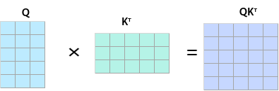

QK<sup>T</sup>矩阵在atten\_mask为True的位置会被遮蔽，效果如下：

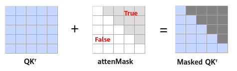

**说明：下图中的蓝色表示保留该值，atten\_mask中，应该配置为False；阴影表示遮蔽该值，atten\_mask中应配置为True。**

-   当sparse\_mode为0时，代表defaultMask模式。
    -   不传mask：如果atten\_mask未传入则不做mask操作，**atten\_mask取值为None**，忽略pre\_tockens和next\_tockens取值。Masked QK<sup>T</sup>矩阵示意如下：

        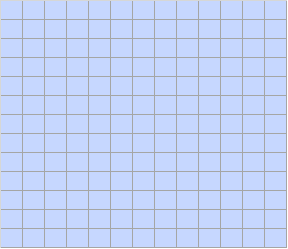

    -   next\_tockens取值为0，pre\_tockens大于等于Sq，表示causal场景sparse，atten\_mask应传入下三角矩阵，此时pre\_tockens和next\_tockens之间的部分需要计算，Masked QK<sup>T</sup>矩阵示意如下：

        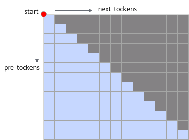

        atten\_mask应传入下三角矩阵，示意如下：

        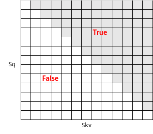

    -   pre\_tockens小于Sq，next\_tockens小于Skv，且都大于等于0，表示band场景，此时pre\_tockens和next\_tockens之间的部分需要计算。Masked QK<sup>T</sup>矩阵示意如下：

        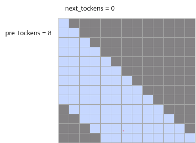

        atten\_mask应传入band形状矩阵，示意如下：

        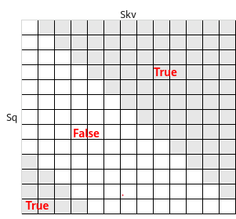

    -   next\_tockens为负数，以pre\_tockens=9，next\_tockens=-3为例，pre\_tockens和next\_tockens之间的部分需要计算。Masked QK<sup>T</sup>示意如下：

        **说明：next\_tockens为负数时，pre\_tockens取值必须大于等于next\_tockens的绝对值，且next\_tockens的绝对值小于Skv。**

        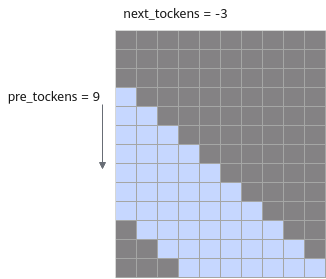

    -   pre\_tockens为负数，以next\_tockens=7，pre\_tockens=-3为例，pre\_tockens和next\_tockens之间的部分需要计算。Masked QK<sup>T</sup>示意如下：

        **说明：pre\_tockens为负数时，next\_tockens取值必须大于等于pre\_tockens的绝对值，且pre\_tockens的绝对值小于Sq。**

        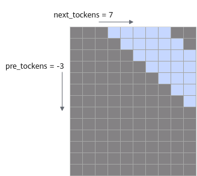

-   当sparse\_mode为1时，代表allMask，即传入完整的atten\_mask矩阵。

    该场景下忽略next\_tockens、pre\_tockens取值，Masked QK<sup>T</sup>矩阵示意如下：

    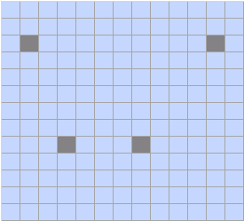

-   当sparse\_mode为2时，代表leftUpCausal模式的mask，对应以左上顶点划分的下三角场景（参数起点为左上角）。该场景下忽略pre\_tockens、next\_tockens取值，Masked QK<sup>T</sup>矩阵示意如下：

    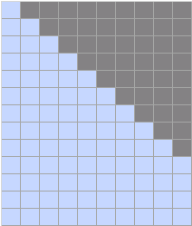

    传入的atten\_mask为优化后的压缩下三角矩阵（2048\*2048），压缩下三角矩阵示意（下同）：

    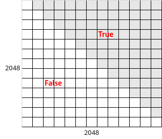

-   当sparse\_mode为3时，代表rightDownCausal模式的mask，对应以右下顶点划分的下三角场景（参数起点为右下角）。该场景下忽略pre\_tockens、next\_tockens取值。atten\_mask为优化后的压缩下三角矩阵（2048\*2048），Masked QK<sup>T</sup>矩阵示意如下：

    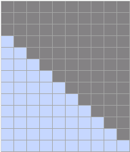

-   当sparse\_mode为4时，代表band场景，即计算pre\_tockens和next\_tockens之间的部分，参数起点为右下角，pre\_tockens和next\_tockens之间需要有交集。atten\_mask为优化后的压缩下三角矩阵（2048\*2048）。Masked QK<sup>T</sup>矩阵示意如下：

    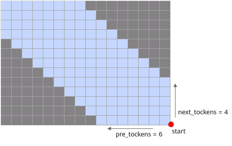

-   当sparse\_mode为5时，代表prefix非压缩场景，即在rightDownCasual的基础上，左侧加上一个长为Sq，宽为N的矩阵，N的值由可选参数prefix获取，例如下图中表示batch=2场景下prefix传入数组\[4,5\]，每个batch轴的N值可以不一样，参数起点为左上角。

    该场景下忽略pre\_tockens、next\_tockens取值，atten\_mask矩阵数据格式须为BNSS或B1SS，Masked QK<sup>T</sup>矩阵示意如下：

    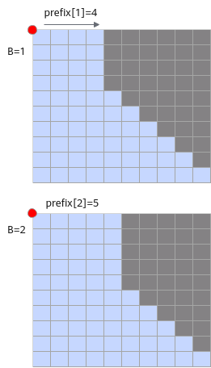

    atten\_mask应传入矩阵示意如下：

    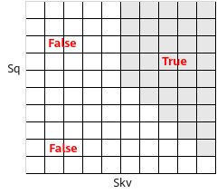

-   当sparse\_mode为6时，代表prefix压缩场景，即prefix场景时，attenMask为优化后的压缩下三角+矩形的矩阵（3072\*2048）：其中上半部分\[2048，2048\]的下三角矩阵，下半部分为\[1024,2048\]的矩形矩阵，矩形矩阵左半部分全0，右半部分全1，atten\_mask应传入矩阵示意如下。该场景下忽略pre\_tockens、next\_tockens取值。

    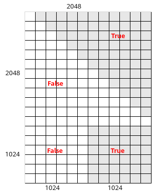

-   当sparse\_mode为7时，表示varlen且为长序列外切场景（即长序列在模型脚本中进行多卡切query的sequence length）；用户需要确保外切前为使用sparse\_mode 3的场景；当前mode下用户需要设置pre\_tockens和next\_tockens（起点为右下顶点），且需要保证参数正确，否则会存在精度问题。

    Masked QK<sup>T</sup>矩阵示意如下，在第二个batch对query进行切分，key和value不切分，4x6的mask矩阵被切分成2x6和2x6的mask，分别在卡1和卡2上计算：

    -   卡1的最后一块mask为band类型的mask，配置pre\_tockens=6（保证大于等于最后一个Skv），next\_tockens=-2，actual\_seq\_qlen应传入\{3,5\}，actual\_seq\_kvlen应传入\{3,9\}。
    -   卡2的mask类型切分后不变，sparse\_mode为3，actual\_seq\_qlen应传入\{2,7,11\}，actual\_seq\_kvlen应传入\{6,11,15\}。

    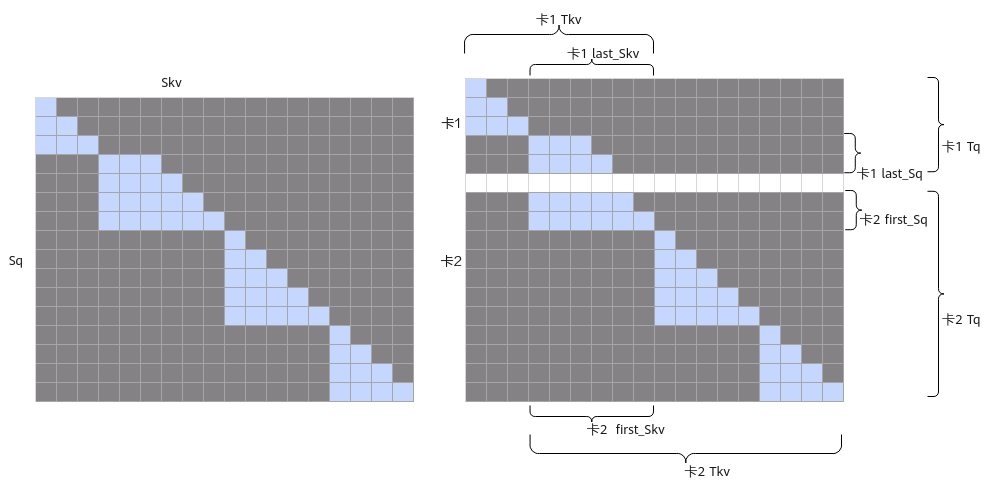

    >**说明：**<br>
    >-   如果配置sparse\_mode=7，但实际只存在一个batch，用户需按照band模式的要求来配置参数；sparse\_mode=7时，用户需要输入2048x2048的下三角mask作为该融合算子的输入。
    >-   基于sparse\_mode=3进行外切产生的band模式的sparse的参数应符合以下条件：
    >    -   pre\_tockens \>= last\_Skv。
    >    -   next\_tockens <= 0。
    >    -   当前模式下不支持可选输入pse。

-   当sparse\_mode为8时，表示varlen且为长序列外切场景；用户需要确保外切前为使用sparse\_mode 2的场景；当前mode下用户需要设置pre\_tockens和next\_tockens（起点为右下顶点），且需要保证参数正确，否则会存在精度问题。

    Masked QK<sup>T</sup>矩阵示意如下，在第二个batch对query进行切分，key和value不切分，5x4的mask矩阵被切分成2x4和3x4的mask，分别在卡1和卡2上计算：

    -   卡1的mask类型切分后不变，sparse\_mode为2，actual\_seq\_qlen应传入\{3,5\}，actual\_seq\_kvlen应传入\{3,7\}。
    -   卡2的第一块mask为band类型的mask，配置pre\_tockens=4（保证大于等于第一个Skv），next\_tockens=1，actual\_seq\_qlen应传入\{3,8,12\}，actual\_seq\_kvlen应传入\{4,9,13\}。

    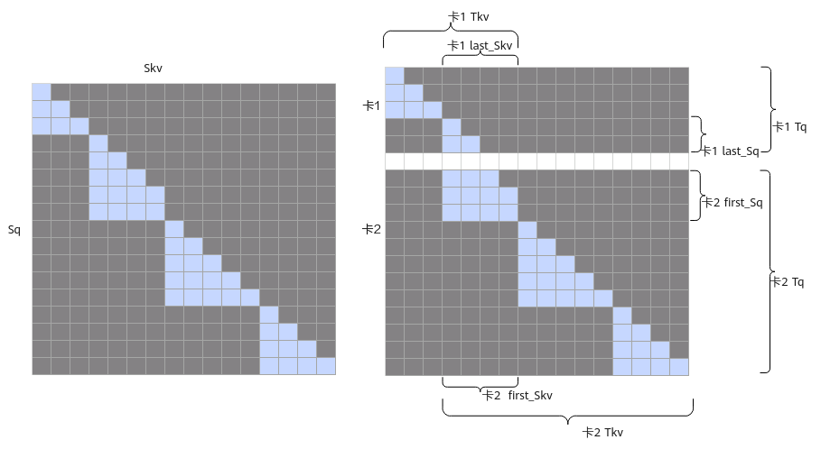

    >**说明：**<br> 
    >-   如果配置sparse\_mode=8，但实际只存在一个batch，用户需按照band模式的要求来配置参数；sparse\_mode=8时，用户需要输入2048x2048的下三角mask作为该融合算子的输入。
    >-   基于sparse\_mode=2进行外切产生的band模式的sparse的参数应符合以下条件：
    >    -   pre\_tockens \>= first\_Skv。
    >    -   next\_tockens范围无约束，根据实际情况进行配置。
    >    -   当前模式下不支持可选输入pse。

