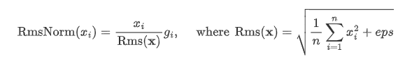

# （beta）torch_npu.npu_rms_norm

## 函数原型

```
torch_npu.npu_rms_norm(Tensor self, Tensor gamma, float epsilon=1e-06) -> (Tensor, Tensor) 
```

## 功能说明

RmsNorm算子是大模型常用的归一化操作，相比LayerNorm算子，其去掉了减去均值的部分。其计算公式为



## 参数说明

- self：Tensor类型，支持float16、bfloat16、float32，输入shape支持2-8维，对应计算公式中的"x"。
- gamma：Tensor类型，数据类型需要和self保持一致，输入shape支持2-8维，通常为self的最后一维，对应计算公式中的"g"。
- epsilon：float数据类型，用于防止除0错误，对应计算公式中的"eps"。

## 输出说明

共两个输出，格式为(Tensor, Tensor)。

第1个输出为Tensor，计算公式的最终输出"RmsNorm(x)"。

第2个输出为Tensor，rms_norm的中间结果为"Rms(x)"的倒数，用于反向计算。

## 约束说明

输入数据类型仅支持float16、bfloat16和float32。

## 支持的型号

- <term>Atlas 训练系列产品</term>
- <term>Atlas A2 训练系列产品</term>
- <term>Atlas A3 训练系列产品</term>
- <term>Atlas 推理系列产品</term>

## 调用示例

```python
>>> x = torch.randn(24, 1, 128).bfloat16().npu()
>>> w = torch.randn(128).bfloat16().npu()
>>> out1 = torch_npu.npu_rms_norm(x, w, epsilon=1e-5)[0]
>>> out1
tensor([[[-0.1875,  0.2383,  0.2334,  ...,  0.8555, -0.0908, -0.3574]],
        [[ 0.0747,  0.4668,  0.1074,  ...,  1.7500,  0.1953, -0.1992]],
        [[-0.0571, -0.4883,  0.5273,  ..., -2.1250, -0.0312,  2.3281]],
        ...,
        [[ 0.0503,  1.9453,  2.6094,  ..., -0.1357,  0.0869, -2.8906]],
        [[ 0.0195,  0.6680, -0.9336,  ..., -0.6641, -0.1904,  0.4336]],
        [[ 0.0972, -1.2344, -1.0078,  ..., -0.5195,  0.3145, -3.7656]]],
       device='npu:0', dtype=torch.bfloat16)
```

