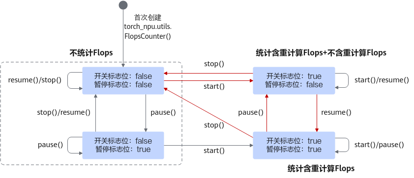

# （beta）torch_npu.utils.FlopsCounter

## 定义文件

torch_npu\utils\flops_count.py

## 函数原型

```
torch_npu.utils.FlopsCounter()
```

## 功能说明

Flops统计类，用于统计各个常见cube类算子的浮点计算Flops，采用单例模式。当前支持可统计Flops的算子：MM、BMM、AllgatherMM、ReduceScatterMM、FA。

## 参数说明

以下参数说明为初始化时此类的参数说明，用户可通过成员函数对参数进行修改。

- 开关标志位（isEnabled_）：默认值false。
- 暂停标志位（isPaused_）：默认值false。
- 含重计算的Flops（traversedCount）：默认不统计含重计算的Flops，且值为0。含重计算的Flops一般用于计算硬件算力利用率(Hardware FLOPs Utilization, HFU)。
- 不含重计算的Flops（recordedCount）：默认不统计不含重计算的Flops，且值为0。不含重计算的Flops一般用于计算模型算力利用率(Model FLOPs Utilization, MFU)。

首次创建（初始化）参数状态和通过成员函数对参数进行修改后，参数的状态如[图1](#fig1515653134316)所示。

**图1** 参数状态<a name="fig1515653134316"></a>  


## 成员函数

- **torch_npu.utils.FlopsCounter.start()**

    开启Flops统计。`FlopsCounter.start()`设置开关标志位（isEnabled_）为true，进行Flops计算，统计含重计算的Flops。

- **torch_npu.utils.FlopsCounter.stop()**

    关闭Flops统计。`FlopsCounter.stop()`设置开关标志位（isEnabled_）和暂停标志位（isPaused_）为false，不进行Flops计算，含重计算的Flops（traversedCount）和不含重计算的Flops（recordedCount）均不统计。且重置含重计算的Flops和不含重计算的Flops为0。

- **torch_npu.utils.FlopsCounter.pause()**

    暂停Flops不含重计算的统计。`FlopsCounter.pause()`设置暂停标志位（isPaused_）为true，不含重计算的Flops（recordedCount）将不会被统计。

- **torch_npu.utils.FlopsCounter.resume()**

    恢复Flops不含重计算的统计。设置暂停标志位（isPaused_）为false。暂停标志位（isPaused_）为false且开关标志位（isEnabled_）为true时，不含重计算的Flops（recordedCount）将会被统计。

- **torch_npu.utils.FlopsCounter.get_flops()**

    获取统计结果。返回列表，包括不含重计算的Flops（recordedCount）和含重计算的Flops（traversedCount），例如[_100, 200_]，_100_为不含重计算的Flops（recordedCount），_200_为含重计算的Flops（traversedCount）。

## 支持的型号

<term>Atlas A2 训练系列产品</term>

## 调用示例

```python
import torch
import torch_npu
 
def matmul():
    x = torch.randn(3, 4).npu()
    y = torch.randn(4, 3).npu()
    torch.matmul(x,y)
 
FlopsCounter = torch_npu.utils.FlopsCounter()
 
# 1.开启统计后进行统计
FlopsCounter.start()
matmul() # 算子计算
print(f"FlopsCounter.start():{FlopsCounter.get_flops()}") # 打印统计结果，含重计算的Flops和不含重计算的Flops累计
 
# 2. 暂停Flops不含重计算统计后进行统计
FlopsCounter.pause()
matmul() # 这里视作重计算操作
print(f"FlopsCounter.pause():{FlopsCounter.get_flops()}") # 仅含重计算Flops累计
 
# 3. 恢复Flops不含重计算统计后进行统计
FlopsCounter.resume()
matmul()
print(f"FlopsCounter.resume():{FlopsCounter.get_flops()}") # 含重计算Flops和不含重计算Flops均累计
 
# 4.关闭Flops统计
FlopsCounter.stop()
matmul()
print(f"FlopsCounter.stop():{FlopsCounter.get_flops()}") # 含重计算Flops和不含重计算Flops清0且均不累计
```

