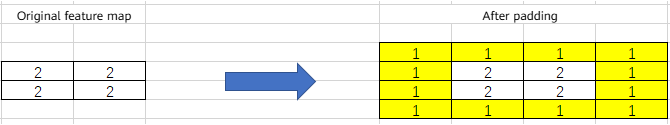

# torch_npu.contrib.module.QuantConv2d

## Supported Products

| Product                                                        | Supported|
| :----------------------------------------------------------- | :------: |
| <term>Atlas A3 training products/Atlas A3 inference products</term>    |    √     |
| <term>Atlas A2 training products/Atlas A2 inference products</term>   |    √     |
| <term>Atlas inference products</term>    |    √     |

## Function

- Description: Encapsulates the `torch_npu.npu_quant_conv2d` API to provide quantization-related functionality for the `Conv2d` operator.

- Formula:

  

## Prototype

```python
torch_npu.contrib.module.QuantConv2d(in_channels, out_channels, kernel_size, output_dtype, stride=1, padding=0, dilation=1, groups=1, bias=True, offset=False, offset_x=0, round_mode="rint", device=None, dtype=None)
```

## Parameters

**Computation Parameters**

- **`in_channels`** (`int`): Required. Number of input channels of `Conv2d`.
- **`out_channels`** (`int`): Required. Number of output channels of `Conv2d`.
- **`kernel_size`** (`int`/`tuple`): Required. Size of the convolution kernel. It can be provided as a single value or a 2D tuple. The value range of `kernel_size` is [1, 255].
- **`output_dtype`** (`torch.dtype`): Required. Output data type. Currently, only `float16` is supported.
- **`stride`** (`int`/`tuple`): Optional. Stride of `Conv2d`. The default value is `1`. It can be provided as a single value or a 2D tuple. The value range of `stride` is [1, 63].
- **`padding`** (`int`/`tuple`): Optional. Padding of `Conv2d`. The default value is `0`. It can be provided as a single value or a 2D tuple. The value range of `padding` is [0, 255].
- **`dilation`** (`int`/`tuple`): Optional. Dilation of `Conv2d`. The default value is `1`. It can be provided as a single value or a 2D tuple. The value range of `dilation` is [1, 255].
- **`groups`** (`int`): Optional. Group of `Conv2d`. The default value is `1`. Currently, only the value `1` is supported.
- **`bias`** (`bool`): Optional. Specifies whether to include bias in the computation. The default value is `True`. If set to `False`, `bias` is excluded from the `QuantConv2d` computation.
- **`offset`** (`bool`): Optional. **Reserved parameter, currently not used**. The default value is `False`.
- **`offset_x`** (`int`): Optional. Actual value filled in padding. The default value is `0`.

     For example, if `padding` is `[1,1]` and `offset_x` is `1`, the fmap changes as follows.

    

- **`round_mode`** (`string`): Optional. The default value is `"rint"`. **Reserved parameter, currently not used.**
- **`device`**: Optional. The default value is `None`. **Reserved parameter, currently not used.**
- **`dtype`**: Optional. The default value is `None`. **Reserved parameter, currently not used.**

**Computation Input**

**`quant_conv2d_input`** (`Tensor`): The data type can be `int8`. The data layout can be NCHW. The shape must have four dimensions.

## Variable Description

- **`weight`** (`Tensor`): The data type can be `int8`. The data layout can be NCHW. This parameter must be 4D.
- **`scale`** (`Tensor`): The data type can be `float32` or `int64`. The data layout can be ND. This parameter must be 1D with shape `(n,)`, where `n` matches the `out_channels` of `weight`.
- **`bias`** (`Tensor`): Optional. The data type can be `int32`. The data layout can be ND. This parameter must be 1D with shape `(n,)`, where `n` matches the `out_channels` of `weight`.

## Output Description

`Tensor`

Computation result of QuantConv2d.

- If `output_dtype` is `"float16"`, the output data type is `float16`.
- Other data types are not supported.

## Constraints

- This API can be used in inference scenarios.
- This API supports only online inference in PyTorch static graph mode.
- Atlas inference products: Scenarios where the W axis of the output tensor is `1` are not supported.

## Example

Graph mode call:

```python
import torch
import torch_npu
import torchair as tng

from torchair.configs.compiler_config import CompilerConfig
from torch_npu.contrib.module import QuantConv2d


torch_npu.npu.set_device(0)
config = CompilerConfig()
npu_backend = tng.get_npu_backend(compiler_config=config)

fmap = torch.randint(-1, 1, (1, 1, 64, 64), dtype=torch.int8).npu()
weight = torch.randint(-1, 1, (1, 1, 3, 3), dtype=torch.int8).npu()
scale = torch.rand((1,), dtype=torch.float32).npu()
bias = torch.randint(-1, 1, (1,), dtype=torch.int32).npu()

model = QuantConv2d(in_channels=1, out_channels=1, kernel_size=(3, 3), output_dtype=torch.float16).npu()
model.weight.data = weight
model.scale.data = scale
model.bias.data = bias

with torch.no_grad():
    static_graph_model = torch.compile(model, backend=npu_backend, dynamic=False)
    output = static_graph_model(fmap)
print("static graph result: ", output)
```
