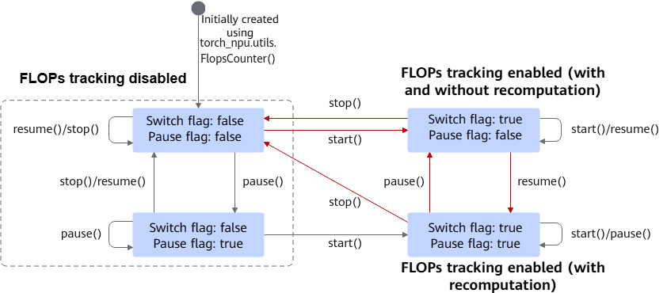

# (beta) torch_npu.utils.FlopsCounter

## Supported Products

| Product                                                        | Supported|
| ------------------------------------------------------------ | :------: |
|<term>Atlas A2 training products</term> | √   |

## Function

Tracks floating-point FLOPs for common cube operators as a singleton statistics class. Currently, operators supported for FLOPs tracking are MM, BMM, AllgatherMM, ReduceScatterMM, and FA.

## Definition File

torch_npu\utils\flops_count.py

## Prototype

```python
torch_npu.utils.FlopsCounter()
```

## Parameters

Initialization parameters for this class are as follows. They can be modified using member functions.

- `isEnabled_`: Switch flag. The default value is `False`.
- `isPaused_`: Pause flag. The default value is `False`.
- `traversedCount`: FLOPs with recomputation. By default, FLOPs with recomputation are not tracked. The default value is `0`. This parameter is generally used to compute hardware FLOPs utilization (HFU).
- `recordedCount`: FLOPs without recomputation. By default, FLOPs without recomputation are not tracked. The default value is `0`. This parameter is generally used to compute model FLOPs utilization (MFU).

[Figure 1](#fig1515653134316) shows the parameter states after initial creation (initialization) or after modifications using member functions.

**Figure 1** Parameter states<a name="fig1515653134316"></a> 


## Member Functions

- **`torch_npu.utils.FlopsCounter.start()`**

    Enables FLOPs tracking. `FlopsCounter.start()` sets the switch flag `isEnabled_` to `True`. This function performs FLOPs counting, tracks FLOPs with recomputation and FLOPs without recomputation.

- **`torch_npu.utils.FlopsCounter.stop()`**

    Disables FLOPs tracking. `FlopsCounter.stop()` sets the switch flag (`isEnabled_`) and pause flag (`isPaused_`) to `False`. This function stops FLOPs counting. FLOPs with recomputation (`traversedCount`) or FLOPs without recomputation (`recordedCount`) are not tracked. This function resets `traversedCount` and `recordedCount` to `0`.

- **`torch_npu.utils.FlopsCounter.pause()`**

    Pauses FLOPs tracking without recomputation. `FlopsCounter.pause()` sets the pause flag (`isPaused_`) to `True`. FLOPs without recomputation (`recordedCount`) are not tracked.

- **`torch_npu.utils.FlopsCounter.resume()`**

    Resumes FLOPs tracking without recomputation. This function sets the pause flag (`isPaused_`) to `False`. FLOPs without recomputation (`recordedCount`) are tracked when `isPaused_` is `False` and `isEnabled_` is `True`.

- **`torch_npu.utils.FlopsCounter.get_flops()`**

    Obtains tracking results. This function returns a list including FLOPs without recomputation (`recordedCount`) and FLOPs with recomputation (`traversedCount`). For example, in `[100, 200]`, `100` is `recordedCount` and `200` is `traversedCount`.

## Example

```python
import torch
import torch_npu
 
def matmul():
    x = torch.randn(3, 4).npu()
    y = torch.randn(4, 3).npu()
    torch.matmul(x,y)
 
FlopsCounter = torch_npu.utils.FlopsCounter()
 
# 1. Enable tracking to perform tracking
FlopsCounter.start()
matmul() # Perform operator computation
print(f"FlopsCounter.start():{FlopsCounter.get_flops()}") # Print tracking results to accumulate FLOPs with recomputation or FLOPs without recomputation
 
# 2. Pause tracking for FLOPs without recomputation to perform tracking
FlopsCounter.pause()
matmul() # Treat as a recomputation operation
print(f"FlopsCounter.pause():{FlopsCounter.get_flops()}") # Accumulate only FLOPs with recomputation
 
# 3. Resume tracking for FLOPs without recomputation to perform tracking
FlopsCounter.resume()
matmul()
print(f"FlopsCounter.resume():{FlopsCounter.get_flops()}") # Accumulate both FLOPs with recomputation or FLOPs without recomputation
 
# 4. Disable FLOPs tracking
FlopsCounter.stop()
matmul()
print(f"FlopsCounter.stop():{FlopsCounter.get_flops()}") # Reset FLOPs metrics to 0 and do not accumulate metrics
```
