# torch\_npu.npu\_fusion\_attention\_v3<a name="en-us_topic_0000002266361349"></a>

> [!NOTICE]  
> This API is a new feature introduced in this version. For details about the specific dependency requirements, see [API Changes](https://gitcode.com/Ascend/pytorch/blob/v2.7.1-26.0.0/docs/en/release_notes/release_notes.md#api-changes).

## Supported Products

| Product                                                        | Supported|
| ------------------------------------------------------------ | :------: |
|<term>Atlas A2 training products</term> | √   |

## Function<a name="en-us_topic_0000001742717129_section14441124184110"></a>

Implements fused computation of the transformer attention score. Computation formula:


This API is the version of `torch_npu.npu_fusion_attention` that supports graph mode. `aclgraph` supports configurations where `input_layout` is set to `BNSD`.

## Prototype<a name="en-us_topic_0000001742717129_section45077510411"></a>

```python
torch_npu.npu_fusion_attention_v3(query, key, value, head_num, input_layout, pse=None, padding_mask=None, atten_mask=None, scale=1., keep_prob=1., pre_tockens=2147483647, next_tockens=2147483647, inner_precise=0, prefix=None, actual_seq_qlen=None, actual_seq_kvlen=None, sparse_mode=0, gen_mask_parallel=True, sync=False, softmax_layout="", sink=None) -> (Tensor, Tensor, Tensor, Tensor, Tensor, Tensor)
```

## Parameters<a name="en-us_topic_0000001742717129_section112637109429"></a>

- **`query`** (`Tensor`): Required. The data type can be `float16`, `bfloat16`, or `float32`. The data layout can be ND. For details about the comprehensive constraints, see [Constraints](#en-us_topic_0000001742717129_section12345537164214).
- **`key`** (`Tensor`): Required. The data type can be `float16`, `bfloat16`, or `float32`. The data layout can be ND. For details about the comprehensive constraints, see [Constraints](#en-us_topic_0000001742717129_section12345537164214).
- **`value`** (`Tensor`): Required. The data type can be `float16`, `bfloat16`, or `float32`. The data layout can be ND. For details about the comprehensive constraints, see [Constraints](#en-us_topic_0000001742717129_section12345537164214).
- **`head_num`** (`int`): Required. Number of heads. The data type can be `int64`. For details about the comprehensive constraints, see [Constraints](#en-us_topic_0000001742717129_section12345537164214).
- **`input_layout`** (`str`): Required. Data layout of the input `query`, `key`, and `value`. Supported layouts: `BSH`, `SBH`, `BSND`, `BNSD`, and `TND` (`actual_seq_qlen` and `actual_seq_kvlen` must both be provided; when `input_layout` is `TND`, the varlen scenario is enabled). In subsequent sections, unless otherwise specified, `S` indicates the sequence length of `query`, `key`, or `value`, `Sq` indicates the sequence length of `query`, `Skv` indicates the sequence length of `key` and `value`, and `SS` indicates the product of `Sq` and `Skv`.
- **`pse`** (`Tensor`): Optional. Positional encoding configuration. The data type can be `float16`, `bfloat16`, or `float32`. The data layout can be ND.
     - In non-varlen scenarios, four-dimensional input shapes are supported, including `BNSS`, `BN1Skv`, and `1NSS` formats.
     - ALiBi positional encoding compression can be enabled in non-varlen scenarios where `Sq` is greater than 1024, or in varlen scenarios where `Sq` and `Skv` of each batch are of equal length and a lower-triangular mask scenario is applied where `sparse_mode` is `0`, `2`, or `3`. In this case, only the last 1024 rows of the original `pse` tensor are required for memory optimization, following the assignment: `alibi_compress = ori_pse[:, :, -1024:, :]`. When parameters differ across batches, the input shape must be `BNHSkv` where `H` equals 1024; when parameters are identical across batches, the input shape must be `1NHSkv` where `H` equals 1024.
- **`padding_mask`** (`Tensor`): This parameter is not supported currently.
- **`atten_mask`** (`Tensor`): Optional. A value of `1` indicates that the position is masked and excluded from computation, while a value of `0` indicates that the position is included in computation. The data type can be `bool` or `uint8`. The data layout can be ND. Supported input shapes include `BNSS`, `B1SS`, `11SS`, and `SS`. In varlen scenarios, only the `SS` format is supported, where `S` corresponds to `maxSq` and `maxSkv`, respectively. For details about the comprehensive constraints, see [Constraints](#en-us_topic_0000001742717129_section12345537164214).
- **`scale`** (`float`): Optional. Scaling factor used as a scalar value for multiplication operations in the computation flow. The data type must be `float`. The default value is `1.0`.
- **`keep_prob`** (`float`): Optional. Dropout keep probability, representing the ratio of retained elements. The value range is `(0, 1]`. The data type must be `float`. The default value is `1.0`, indicating all elements are retained.
- **`pre_tockens`** (`int`): Optional. Parameter used for sparse computation. The data type can be `int64`. The default value is `2147483647`. For details about the comprehensive constraints, see [Constraints](#en-us_topic_0000001742717129_section12345537164214).
- **`next_tockens`** (`int`): Optional. Parameter used for sparse computation. The data type can be `int64`. The default value is `2147483647`. For the relationship between `next_tockens`, `pre_tockens`, and `atten_mask`, see the `sparse_mode` parameter. Any inconsistency between the parameter value and the actual `atten_mask` distribution will cause precision degradation. For details about the comprehensive constraints, see [Constraints](#en-us_topic_0000001742717129_section12345537164214).
- **`inner_precise`** (`int`): Optional. Used to improve precision. The data type can be `int64`. The default value is `0`.

    > [!NOTE]  
    > Values of `0` and `1` are currently reserved. A value of `2` enables invalid row computation, which prevents precision loss caused by fully masked rows during computation, but can degrade performance.
    >If the operator detects an invalid row scenario (for example, when `sparse_mode` is `3` and `Sq` is greater than `Skv`), invalid row computation is automatically enabled.

- **`prefix`** (`List[int]`): Optional. `N` value of each batch in the prefix sparse computation scenario. The data type can be `int64`. The data layout can be ND. For details about the comprehensive constraints, see [Constraints](#en-us_topic_0000001742717129_section12345537164214).
- **`actual_seq_qlen`** (`Tensor`): Optional. This parameter must be provided in varlen scenarios as a one-dimensional CPU `Tensor`. representing the cumulative sequence length of each `S` dimension in `query`. The data type can be `int64`. The data layout can be ND. For details about the comprehensive constraints, see [Constraints](#en-us_topic_0000001742717129_section12345537164214).

    For example, if the actual sequence lengths are `2`, `2`, `2`, `2`, and `2`, then `actual_seq_qlen` must be `2`, `4`, `6`, `8`, and `10`.

- **`actual_seq_kvlen`** (`Tensor`): Optional. This parameter must be provided in varlen scenarios as a one-dimensional CPU `Tensor`. representing the cumulative sequence length of each `S` dimension in `key` and `value`. The data type can be `int64`. The data layout can be ND. For details about the comprehensive constraints, see [Constraints](#en-us_topic_0000001742717129_section12345537164214).

    For example, if the actual sequence lengths are `2`, `2`, `2`, `2`, and `2`, then `actual_seq_kvlen` must be `2`, `4`, `6`, `8`, and `10`.

- **`sparse_mode`** (`int`): Optional. Sparse attention mode. The default value is `0`. Valid values are listed in [Table 1](#en-us_topic_0000001742717129_table1946917414436). For details about different modes, see [References](#en-us_topic_0000001742717129_section28169228374). When `atten_mask` is identical across the entire network and its shape is less than 2048 \* 2048, use `defaultMask` mode to reduce memory usage. For details about the comprehensive constraints, see [Constraints](#en-us_topic_0000001742717129_section12345537164214).

    **Table 1** Description of different sparse\_mode values

    <a name="en-us_topic_0000001742717129_table1946917414436"></a>
    <table><thead align="left"><tr id="en-us_topic_0000001742717129_row84694414435"><th class="cellrowborder" valign="top" width="18.001800180018%" id="mcps1.2.4.1.1"><p id="en-us_topic_0000001742717129_p174691404320"><a name="en-us_topic_0000001742717129_p174691404320"></a><a name="en-us_topic_0000001742717129_p174691404320"></a>sparse_mode</p>
    </th>
    <th class="cellrowborder" valign="top" width="45.324532453245325%" id="mcps1.2.4.1.2"><p id="en-us_topic_0000001742717129_p114691045439"><a name="en-us_topic_0000001742717129_p114691045439"></a><a name="en-us_topic_0000001742717129_p114691045439"></a>Meaning</p>
    </th>
    <th class="cellrowborder" valign="top" width="36.67366736673668%" id="mcps1.2.4.1.3"><p id="en-us_topic_0000001742717129_p194697418436"><a name="en-us_topic_0000001742717129_p194697418436"></a><a name="en-us_topic_0000001742717129_p194697418436"></a>Remarks</p>
    </th>
    </tr>
    </thead>
    <tbody><tr id="en-us_topic_0000001742717129_row946924164313"><td class="cellrowborder" valign="top" width="18.001800180018%" headers="mcps1.2.4.1.1 "><p id="en-us_topic_0000001742717129_p8469144184316"><a name="en-us_topic_0000001742717129_p8469144184316"></a><a name="en-us_topic_0000001742717129_p8469144184316"></a>0</p>
    </td>
    <td class="cellrowborder" valign="top" width="45.324532453245325%" headers="mcps1.2.4.1.2 "><p id="en-us_topic_0000001742717129_p146910414313"><a name="en-us_topic_0000001742717129_p146910414313"></a><a name="en-us_topic_0000001742717129_p146910414313"></a><code>defaultMask</code> mode</p>
    </td>
    <td class="cellrowborder" valign="top" width="36.67366736673668%" headers="mcps1.2.4.1.3 "><p id="en-us_topic_0000001742717129_p44691142433"><a name="en-us_topic_0000001742717129_p44691142433"></a><a name="en-us_topic_0000001742717129_p44691142433"></a>-</p>
    </td>
    </tr>
    <tr id="en-us_topic_0000001742717129_row1446911419433"><td class="cellrowborder" valign="top" width="18.001800180018%" headers="mcps1.2.4.1.1 "><p id="en-us_topic_0000001742717129_p164691416431"><a name="en-us_topic_0000001742717129_p164691416431"></a><a name="en-us_topic_0000001742717129_p164691416431"></a>1</p>
    </td>
    <td class="cellrowborder" valign="top" width="45.324532453245325%" headers="mcps1.2.4.1.2 "><p id="en-us_topic_0000001742717129_p146904204320"><a name="en-us_topic_0000001742717129_p146904204320"></a><a name="en-us_topic_0000001742717129_p146904204320"></a><code>allMask</code> mode</p>
    </td>
    <td class="cellrowborder" valign="top" width="36.67366736673668%" headers="mcps1.2.4.1.3 "><p id="en-us_topic_0000001742717129_p20469174194319"><a name="en-us_topic_0000001742717129_p20469174194319"></a><a name="en-us_topic_0000001742717129_p20469174194319"></a>-</p>
    </td>
    </tr>
    <tr id="en-us_topic_0000001742717129_row15469194124313"><td class="cellrowborder" valign="top" width="18.001800180018%" headers="mcps1.2.4.1.1 "><p id="en-us_topic_0000001742717129_p04691048436"><a name="en-us_topic_0000001742717129_p04691048436"></a><a name="en-us_topic_0000001742717129_p04691048436"></a>2</p>
    </td>
    <td class="cellrowborder" valign="top" width="45.324532453245325%" headers="mcps1.2.4.1.2 "><p id="en-us_topic_0000001742717129_p24691441430"><a name="en-us_topic_0000001742717129_p24691441430"></a><a name="en-us_topic_0000001742717129_p24691441430"></a><code>leftUpCausal</code> mode</p>
    </td>
    <td class="cellrowborder" valign="top" width="36.67366736673668%" headers="mcps1.2.4.1.3 "><p id="en-us_topic_0000001742717129_p16469134124314"><a name="en-us_topic_0000001742717129_p16469134124314"></a><a name="en-us_topic_0000001742717129_p16469134124314"></a>-</p>
    </td>
    </tr>
    <tr id="en-us_topic_0000001742717129_row1946915417431"><td class="cellrowborder" valign="top" width="18.001800180018%" headers="mcps1.2.4.1.1 "><p id="en-us_topic_0000001742717129_p04699464316"><a name="en-us_topic_0000001742717129_p04699464316"></a><a name="en-us_topic_0000001742717129_p04699464316"></a>3</p>
    </td>
    <td class="cellrowborder" valign="top" width="45.324532453245325%" headers="mcps1.2.4.1.2 "><p id="en-us_topic_0000001742717129_p1546934144317"><a name="en-us_topic_0000001742717129_p1546934144317"></a><a name="en-us_topic_0000001742717129_p1546934144317"></a><code>rightDownCausal</code> mode</p>
    </td>
    <td class="cellrowborder" valign="top" width="36.67366736673668%" headers="mcps1.2.4.1.3 "><p id="en-us_topic_0000001742717129_p0469104114318"><a name="en-us_topic_0000001742717129_p0469104114318"></a><a name="en-us_topic_0000001742717129_p0469104114318"></a>-</p>
    </td>
    </tr>
    <tr id="en-us_topic_0000001742717129_row1246974194310"><td class="cellrowborder" valign="top" width="18.001800180018%" headers="mcps1.2.4.1.1 "><p id="en-us_topic_0000001742717129_p154693411430"><a name="en-us_topic_0000001742717129_p154693411430"></a><a name="en-us_topic_0000001742717129_p154693411430"></a>4</p>
    </td>
    <td class="cellrowborder" valign="top" width="45.324532453245325%" headers="mcps1.2.4.1.2 "><p id="en-us_topic_0000001742717129_p1646917414434"><a name="en-us_topic_0000001742717129_p1646917414434"></a><a name="en-us_topic_0000001742717129_p1646917414434"></a><code>band</code> mode</p>
    </td>
    <td class="cellrowborder" valign="top" width="36.67366736673668%" headers="mcps1.2.4.1.3 "><p id="en-us_topic_0000001742717129_p746954104316"><a name="en-us_topic_0000001742717129_p746954104316"></a><a name="en-us_topic_0000001742717129_p746954104316"></a>-</p>
    </td>
    </tr>
    <tr id="en-us_topic_0000001742717129_row2046954144314"><td class="cellrowborder" valign="top" width="18.001800180018%" headers="mcps1.2.4.1.1 "><p id="en-us_topic_0000001742717129_p1946904194319"><a name="en-us_topic_0000001742717129_p1946904194319"></a><a name="en-us_topic_0000001742717129_p1946904194319"></a>5</p>
    </td>
    <td class="cellrowborder" valign="top" width="45.324532453245325%" headers="mcps1.2.4.1.2 "><p id="en-us_topic_0000001742717129_p1746924174311"><a name="en-us_topic_0000001742717129_p1746924174311"></a><a name="en-us_topic_0000001742717129_p1746924174311"></a><code>prefix</code> non-compression mode</p>
    </td>
    <td class="cellrowborder" valign="top" width="36.67366736673668%" headers="mcps1.2.4.1.3 "><p id="en-us_topic_0000001742717129_p154701410430"><a name="en-us_topic_0000001742717129_p154701410430"></a><a name="en-us_topic_0000001742717129_p154701410430"></a>Not supported in the varlen scenario.</p>
    </td>
    </tr>
    <tr id="en-us_topic_0000001742717129_row74701045439"><td class="cellrowborder" valign="top" width="18.001800180018%" headers="mcps1.2.4.1.1 "><p id="en-us_topic_0000001742717129_p54702411437"><a name="en-us_topic_0000001742717129_p54702411437"></a><a name="en-us_topic_0000001742717129_p54702411437"></a>6</p>
    </td>
    <td class="cellrowborder" valign="top" width="45.324532453245325%" headers="mcps1.2.4.1.2 "><p id="en-us_topic_0000001742717129_p4470643434"><a name="en-us_topic_0000001742717129_p4470643434"></a><a name="en-us_topic_0000001742717129_p4470643434"></a><code>prefix</code> compression mode</p>
    </td>
    <td class="cellrowborder" valign="top" width="36.67366736673668%" headers="mcps1.2.4.1.3 "><p id="en-us_topic_0000001742717129_p7470154114317"><a name="en-us_topic_0000001742717129_p7470154114317"></a><a name="en-us_topic_0000001742717129_p7470154114317"></a>-</p>
    </td>
    </tr>
    <tr id="en-us_topic_0000001742717129_row161481137124310"><td class="cellrowborder" valign="top" width="18.001800180018%" headers="mcps1.2.4.1.1 "><p id="en-us_topic_0000001742717129_p17148173754313"><a name="en-us_topic_0000001742717129_p17148173754313"></a><a name="en-us_topic_0000001742717129_p17148173754313"></a>7</p>
    </td>
    <td class="cellrowborder" valign="top" width="45.324532453245325%" headers="mcps1.2.4.1.2 "><p id="en-us_topic_0000001742717129_p514893764315"><a name="en-us_topic_0000001742717129_p514893764315"></a><a name="en-us_topic_0000001742717129_p514893764315"></a>Varlen out-of-model splitting scenario, <code>rightDownCausal</code> mode</p>
    </td>
    <td class="cellrowborder" valign="top" width="36.67366736673668%" headers="mcps1.2.4.1.3 "><p id="en-us_topic_0000001742717129_p61481637134316"><a name="en-us_topic_0000001742717129_p61481637134316"></a><a name="en-us_topic_0000001742717129_p61481637134316"></a>Supported only in the varlen scenario.</p>
    </td>
    </tr>
    <tr id="en-us_topic_0000001742717129_row1289424013438"><td class="cellrowborder" valign="top" width="18.001800180018%" headers="mcps1.2.4.1.1 "><p id="en-us_topic_0000001742717129_p12894174013438"><a name="en-us_topic_0000001742717129_p12894174013438"></a><a name="en-us_topic_0000001742717129_p12894174013438"></a>8</p>
    </td>
    <td class="cellrowborder" valign="top" width="45.324532453245325%" headers="mcps1.2.4.1.2 "><p id="en-us_topic_0000001742717129_p12895104011434"><a name="en-us_topic_0000001742717129_p12895104011434"></a><a name="en-us_topic_0000001742717129_p12895104011434"></a>Varlen out-of-model splitting scenario, <code>leftUpCausal</code> mode</p>
    </td>
    <td class="cellrowborder" valign="top" width="36.67366736673668%" headers="mcps1.2.4.1.3 "><p id="en-us_topic_0000001742717129_p8895140154311"><a name="en-us_topic_0000001742717129_p8895140154311"></a><a name="en-us_topic_0000001742717129_p8895140154311"></a>Supported only in the varlen scenario.</p>
    </td>
    </tr>
    </tbody>
    </table>

- **`gen_mask_parallel`** (`bool`): Optional. Controls the parallel execution mode for DSA dropout mask vector generation. The default value is `True`, indicating parallel computation with the AI Core. When set to `False`, it indicates serial computation with the AI Core.
- **`sync`** (`bool`): Optional. Controls the synchronization mode for DSA dropout mask vector generation. The default value is `False`, indicating asynchronous generation of the dropout mask. When set to `True`, it indicates synchronous generation of the dropout mask.
- **`softmax_layout`** (`string`): Optional. Controls the data layout of the softmax outputs (`softmax_max` and `softmax_sum`) in the `TND` scenario. This parameter must only be configured when `input_layout` is `"TND"`, and supports only `"TND"`. By default, the softmax outputs use the `NTD` layout. When `"TND"` is provided, the softmax outputs use the `TND` layout.
- **`sink`** (`Tensor`): Optional. Bias for each attention head. The shape must be `[head_num]`, and the data type can only be `float32`.

## Outputs<a name="en-us_topic_0000001742717129_section22231435517"></a>

Six outputs are generated in the following types: `Tensor`, `Tensor`, `Tensor`, `Tensor`, `Tensor`, `Tensor`, respectively.

- The first output is a `Tensor` representing the final output $attention\_out$ of the computation formula. The data type can be `float16`, `bfloat16`, or `float32`.
- The second output is a `Tensor` representing the intermediate maximum value of the softmax computation, used for backward computation. The data type can be `float`.
- The third output is a `Tensor` representing the intermediate sum value of the softmax calculation, used for backward computation. The data type can be `float`.
- The fourth output is a reserved `Tensor`, which is currently not used.
- The fifth output is a `Tensor` representing the seed of the Philox algorithm in DSA dropout mask generation. In `aclgraph` scenarios, an NPU `Tensor` is returned. In non-`aclgraph` scenarios, a CPU `Tensor` is returned.
- The sixth output is a `Tensor` representing the offset of the Philox algorithm in DSA dropout mask generation. In `aclgraph` scenarios, an NPU `Tensor` is returned. In non-`aclgraph` scenarios, a CPU `Tensor` is returned.

## Constraints<a name="en-us_topic_0000001742717129_section12345537164214"></a>

- This API is used only in training scenarios.
- The data types of `query`, `key`, `value`, and `pse` must be identical.
- The `input_layout` of `query`, `key`, and `value` must be identical.
- Shape descriptions for `query`, `key`, and `value`:
    - The shapes of `key` and `value` must be identical.
    - `B`: The batch size must be identical across inputs. In non-varlen scenarios, the value ranges from 1 to 2M. In varlen scenarios, the value ranges from 1 to 2K.
    - `D`: head dimension. `Dq` must equal `Dk` and `Dk` must be greater than or equal to `Dv`. The value ranges from 1 to 768.
    - `S`: sequence length. The value ranges from 1 to 1M.

- In varlen scenarios:
    - The value of `T` (`B` * `S`) must range from 1 to 1M.
    - Padding is not supported for the `atten_mask` input. That is, no row in `atten_mask` can be entirely filled with `1`.

- `N` of the input `query` can be different from `N` of the `key` or `value`, but they must be proportional. That is, `Nq/Nkv` must be a non-zero integer and the value of `Nq` ranges from 1 to 256. When the ratio of `Nq` to `Nkv` is greater than 1, Grouped-Query Attention (GQA) is enabled. When the ratio of `Nq` to `Nkv` is 1, Multi-Head Attention (MHA) is enabled.

    > [!NOTE]  
    > Unless otherwise specified, `N` refers to `Nq` in this document.

- Value descriptions for `sparse_mode`:
    - When `sparse_mode` is `1`, `2`, `3`, `4`, `5`, `6`, `7`, or `8`, the correct corresponding `atten_mask` must be provided, otherwise the computation results will be incorrect. When `atten_mask` is `None`, the `sparse_mode`, `pre_tockens`, and `next_tockens` parameters do not take effect, and full computation is used.
    - When `sparse_mode` is configured as `1`, `2`, `3`, `5`, or `6`, the user-configured `pre_tockens` and `next_tockens` do not take effect.
    - When `sparse_mode` is set to `0` or `4`, ensure that the value range of `atten_mask` matches those of `pre_tockens` and `next_tockens`.
    - When `sparse_mode` is set to `7` or `8`, the optional parameter `pse` is not supported.

- In prefix sparse computation scenarios, `B` must be less than or equal to 32. In varlen scenarios, uncompressed prefix configurations are not supported, meaning `sparse_mode` cannot be `5`. When `Sq` is greater than `Skv`, the `N` dimension of `prefix` falls in the range of `[0, Skv]`. When `Sq` is less than or equal to `Skv`, the `N` dimension of `prefix` falls in the range of `[Skv - Sq, Skv]`.
- The length of `S` for a batch in `actual_seq_qlen` can be `0`. If `S` is `0`, `pse` is not supported. For example, if the actual sequence lengths are `[2, 2, 0, 2, 2]`, then the provided `actual_seq_qlen` must be `[2, 4, 4, 6, 8]`. The length of `actual_seq_qlen` must be 1 to 2K, and the maximum supported length in varlen scenarios is 1K.
- In `TND` layouts, trailing batches can be excluded from computation by providing the corresponding number of trailing zeros in `actual_seq_qlen` and `actual_seq_kvlen`. For example, if the actual sequence lengths are `[2, 3, 4, 5, 6]` and the last two batches do not participate in computation, the provided `actual_seq_qlen` must be `[2, 5, 9, 0, 0]`.
- Excessively large computational workloads can cause operator execution timeouts, raising an AI Core error (`errorStr`: "timeout or trap error"). In this case, axis partitioning is recommended. The computational workload is determined by parameters including `B`, `S`, `N`, and `D`. Larger parameter values result in higher computational workload.

## Examples<a name="en-us_topic_0000001742717129_section14459801435"></a>

Single-operator call

```python
import math
import unittest
import numpy as np
import torch
import torch_npu
from torch_npu.testing.testcase import TestCase, run_tests
from torch_npu.testing.common_utils import SupportedDevices


class TestNPUFlashAttention(TestCase):
    def supported_op_exec(self, query, key, value, atten_mask):
        scale = 0.08838
        qk = torch.matmul(query, key.transpose(2, 3)).mul(scale)
        qk = qk + atten_mask * (-10000.0)
        softmax_res = torch.nn.functional.softmax(qk, dim=-1)
        attention_out = torch.matmul(softmax_res, value)
        return attention_out

    def custom_op_exec(self, query, key, value, sparse_params):
        scale = 0.08838
        atten_mask = None
        if sparse_params[0] == 0:
            shape = [1, 8, 256, 256]
            mask = torch.ones(shape, dtype=torch.bool, device='npu')
            atten_mask_u = torch.triu(mask, diagonal=sparse_params[1] + 1)
            atten_mask_l = torch.tril(mask, diagonal=-sparse_params[2] - 1)
            atten_mask = atten_mask_u | atten_mask_l
        if sparse_params[0] == 2 or sparse_params[0] == 3 or sparse_params[0] == 4:
            atten_mask = torch.triu(torch.ones(2048, 2048, dtype=torch.bool, device='npu'), diagonal=1)
        return torch_npu.npu_fusion_attention_v3(
            query, key, value, head_num=8, input_layout="BNSD", scale=scale, sparse_mode=sparse_params[0],
            atten_mask=atten_mask, pre_tockens=sparse_params[1], next_tockens=sparse_params[2])

    def get_atten_mask(self, sparse_mode=0, pre_tockens=65536, next_tockens=65536):
        atten_masks = []
        shape = [1, 8, 256, 256]
        if sparse_mode == 0:
            atten_mask_u = np.triu(np.ones(shape), k=next_tockens + 1)
            atten_mask_l = np.tril(np.ones(shape), k=-pre_tockens - 1)
            atten_masks = atten_mask_u + atten_mask_l

        elif sparse_mode == 1:
            atten_masks = np.zeros(shape)
            pre_tockens = 65536
            next_tockens = 65536

        elif sparse_mode == 2:
            atten_masks = np.triu(np.ones(shape), k=1)

        elif sparse_mode == 3:
            atten_masks = np.triu(np.ones(shape), k=1)

        elif sparse_mode == 4:
            atten_mask_u = np.triu(np.ones(shape), k=next_tockens + 1)
            atten_mask_l = np.tril(np.ones(shape), k=-pre_tockens - 1)
            atten_masks = atten_mask_u + atten_mask_l

        atten_mask = torch.tensor(atten_masks).to(torch.float16)
        return atten_mask

    # sparse_params = [sparse_mode, pre_tockens, next_tockens]
    # Prec and prec16 indicate the precision comparison standards for float32 and float16 respectively.
    # In this example, 0.01 is used as the standard. You can change the value as required. 
    def check_result(self, query, key, value, sparse_params):
        atten_mask = self.get_atten_mask(sparse_params[0], sparse_params[1], sparse_params[2])
        output = self.supported_op_exec(query.float(), key.float(), value.float(), atten_mask)
        fa_result = self.custom_op_exec(query.npu(), key.npu(), value.npu(), sparse_params)
        self.assertRtolEqual(output.half(), fa_result[0], prec=0.01, prec16=0.01)


    def test_npu_flash_attention(self, device="npu"):
        query = torch.randn(1, 8, 256, 256, dtype=torch.float16)
        key = torch.randn(1, 8, 256, 256, dtype=torch.float16)
        value = torch.randn(1, 8, 256, 256, dtype=torch.float16)

        # sparse_params: [sparse_mode, pre_tockens, next_tockens]
        sparse_params_list = [
            [0, 128, 128],
            [1, 65536, 65536],
            [2, 65536, 0],
            [3, 65536, 0],
            [4, 128, 128]
        ]

        for sparse_params in sparse_params_list:
            self.check_result(query, key, value, sparse_params)

if __name__ == "__main__":
    run_tests()
```

## References<a name="en-us_topic_0000001742717129_section28169228374"></a>

`atten_mask` masks the product of `query` (Q) and the transposed `key` (K) at positions where the mask is `True`, as shown in the following figure.

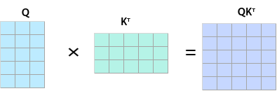

The QK<sup>T</sup> matrix is masked at positions where `atten_mask` is `True`, as shown in the following figure.

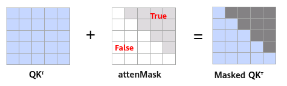

**Note: In the following figures, blue indicates retained values that must be configured as `False` in `atten_mask`, and shaded regions indicate masked values that must be configured as `True` in `atten_mask`.**

- When `sparse_mode` is set to `0`, `defaultMask` mode is enabled.
    - Omitted mask: If `atten_mask` is omitted, no masking operation is performed. The value of `atten_mask` defaults to `None`, and the values of `pre_tockens` and `next_tockens` are ignored. The following figure shows the masked QK<sup>T</sup> matrix.

        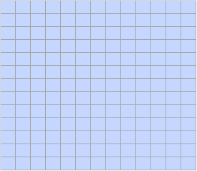

    - When `next_tockens` is set to `0` and `pre_tockens` is greater than or equal to `Sq`, causal sparse attention is enabled. A lower-triangular matrix must be provided for `atten_mask`, and the region between `pre_tockens` and `next_tockens` is computed. The following figure shows the masked QK<sup>T</sup> matrix.

        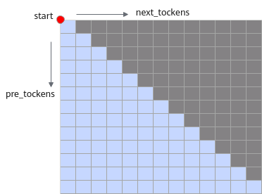

        The following figure shows the lower-triangular matrix for `atten_mask`.

        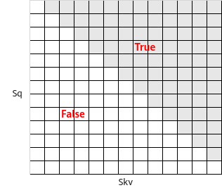

    - When `pre_tockens` is less than `Sq`, `next_tockens` is less than `Skv`, and both are greater than or equal to `0`, band attention is enabled. The region between `pre_tockens` and `next_tockens` is computed. The following figure shows the masked QK<sup>T</sup> matrix.

        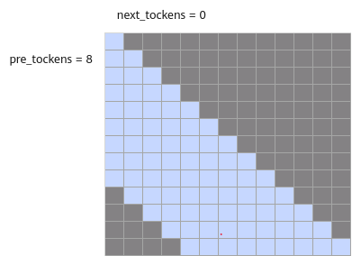

        The following figure shows the band shape matrix for `atten_mask`.

        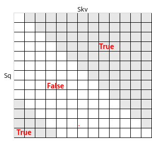

    - When `next_tockens` is negative, taking `pre_tockens=9` and `next_tockens=-3` as an example, the region between `pre_tockens` and `next_tockens` is computed. The following figure shows the masked QK<sup>T</sup> matrix.

        **When `next_tockens` is negative, the value of `pre_tockens` must be greater than or equal to the absolute value of `next_tockens`, and the absolute value of `next_tockens` must be less than `Skv`.**

        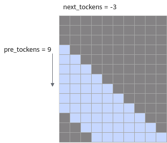

    - When `pre_tockens` is negative, taking `next_tockens=7` and `pre_tockens=-3` as an example, the region between `pre_tockens` and `next_tockens` is computed. The following figure shows the masked QK<sup>T</sup> matrix.

        **When `pre_tockens` is negative, the value of `next_tockens` must be greater than or equal to the absolute value of `pre_tockens`, and the absolute value of `pre_tockens` must be less than `Sq`.**

        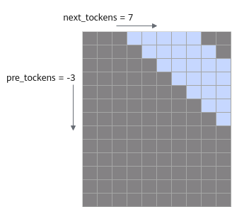

- When `sparse_mode` is set to `1`, `allMask` mode is enabled. A complete `atten_mask` matrix must be provided.

    In this scenario, the values of `next_tockens` and `pre_tockens` are ignored. The following figure shows the masked QK<sup>T</sup> matrix.

    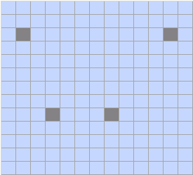

- When `sparse_mode` is set to `2`, `leftUpCausal` mode is enabled. This configuration corresponds to a lower-triangular scenario with the upper-left vertex as the origin. In this scenario, the values of `pre_tockens` and `next_tockens` are ignored. The following figure shows the masked QK<sup>T</sup> matrix.

    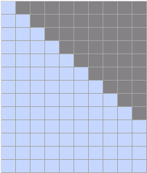

    The input `atten_mask` is an optimized compressed lower-triangular matrix with shape `(2048, 2048)`. The following figure shows the compressed lower-triangular matrix structure.

    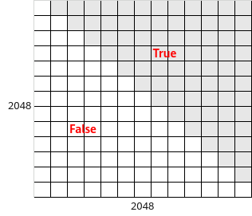

- When `sparse_mode` is set to `3`, `rightDownCausal` mode is enabled. This configuration corresponds to a lower-triangular scenario with the lower-right vertex as the origin. In this scenario, the values of `pre_tockens` and `next_tockens` are ignored. The `atten_mask` is an optimized compressed lower-triangular matrix with shape `(2048, 2048)`. The following figure shows the masked QK<sup>T</sup> matrix.

    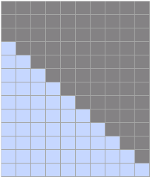

- When `sparse_mode` is set to `4`, band attention is enabled. This mode computes the region between `pre_tockens` and `next_tockens`. The origin is the lower-right vertex, and an intersection must exist between `pre_tockens` and `next_tockens`. The `atten_mask` is an optimized compressed lower-triangular matrix with shape `(2048, 2048)`. The following figure shows the masked QK<sup>T</sup> matrix.

    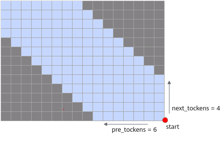

- When `sparse_mode` is set to `5`, the prefix non-compressed mode is enabled. In this mode, a matrix with length `Sq` and width `N` is appended to the left side of the `rightDownCausal` layout. The value of `N` is obtained from the optional parameter `prefix`. For example, in a `batch=2` scenario, the input `prefix` array can be `[4,5]`, and the value of `N` can differ across batch axes. The origin is the upper-left vertex.

    In this scenario, the values of `pre_tockens` and `next_tockens` are ignored. The `atten_mask` matrix data format must be `BNSS` or `B1SS`. The following figure shows the masked QK<sup>T</sup> matrix.

    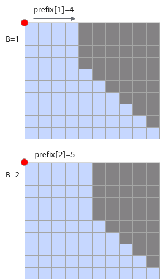

    The following figure shows the provided matrix layout for `atten_mask`.

    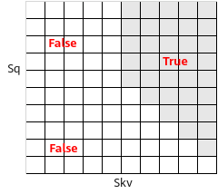

- When `sparse_mode` is set to `6`, the prefix compressed mode is enabled. In this case, `atten_mask` is an optimized compressed matrix combining a lower-triangular matrix and a rectangular matrix with shape `(3072, 2048)`. The upper part is a lower-triangular matrix with shape `(2048, 2048)`. The lower part is a rectangular matrix with shape `(1024, 2048)` where the left half is entirely filled with `0` and the right half is entirely filled with `1`. In this scenario, the values of `pre_tockens` and `next_tockens` are ignored.

    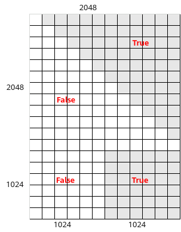

- When `sparse_mode` is set to `7`, a varlen scenario with long-sequence out-of-model splitting is enabled. That is, long sequences are sliced along the query sequence length across multiple ranks in the model script. Users must ensure that `sparse_mode=3` is applied before slicing. In this mode, `pre_tockens` and `next_tockens` must be configured explicitly with the origin at the lower-right vertex. The parameter values must be mathematically correct to prevent accuracy degradation.

    The following figure shows the masked QK<sup>T</sup> matrix. In this configuration, `query` is split in the second batch while `key` and `value` are not split. This layout causes a mask matrix with shape `(4, 6)` to be partitioned into two masks with shape `(2, 6)` computed on rank 1 and rank 2, respectively.

    - On rank 1, the final mask block is a band-type mask. Configure `pre_tockens=6` (ensuring it is greater than or equal to the final `Skv` value), `next_tockens=-2`, `actual_seq_qlen={3,5}`, and `actual_seq_kvlen={3,9}`.
    - On rank 2, the mask structure type remains unchanged after slicing. Configure `sparse_mode=3`, `actual_seq_qlen=`{2,7,11}, and `actual_seq_kvlen={6,11,15}`.

    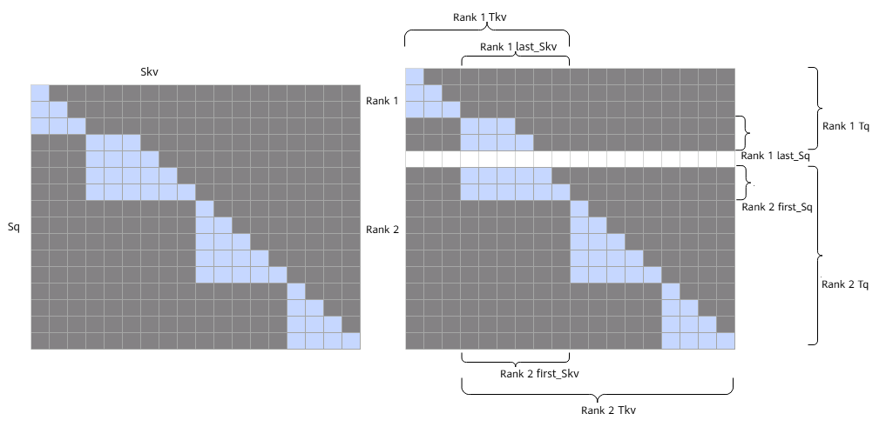

    > [!NOTE]  
    > - If `sparse_mode` is set to `7` but only one batch exists, configure the parameters based on the requirements of the band attention mode. When `sparse_mode` is set to `7`, a lower-triangular mask with shape `(2048, 2048)` must be provided as the input for this fused operator.
    > - The sparse attention parameters for the band attention mode generated by out-of-model splitting when `sparse_mode` is set to `3` must satisfy the following conditions:
    > - `pre_tockens` is greater than or equal to `last_Skv`.
    > - `next_tockens` is less than or equal to `0`.
    > - The optional input parameter `pse` is not supported in this mode.

- When `sparse_mode` is set to `8`, a varlen scenario with long-sequence out-of-model splitting is enabled. Users must ensure that `sparse_mode=2` is applied before splitting. In this mode, `pre_tockens` and `next_tockens` must be configured explicitly with the origin at the lower-right vertex. The parameter values must be mathematically correct to prevent accuracy degradation.

    The following figure shows the masked QK<sup>T</sup> matrix. In this configuration, `query` is split in the second batch while `key` and `value` are not split. This layout causes a mask matrix with shape `(5, 4)` to be partitioned into a mask with shape `(2, 4)` and a mask with shape `(3, 4)` computed on rank 1 and rank 2, respectively.

    - On rank 1, the mask structure type remains unchanged after splitting. Configure `sparse_mode=2`, `actual_seq_qlen={3,5}`, and `actual_seq_kvlen={3,7}`.
    - On rank 2, the first mask block is a band-type mask. Configure `pre_tockens=4` (ensuring it is greater than or equal to the initial `Skv` value), `next_tockens=1`, `actual_seq_qlen={3,8,12}`, and `actual_seq_kvlen=`{4,9,13}.

    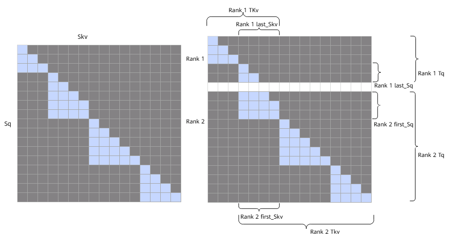

    > [!NOTE]   
    > - If `sparse_mode` is set to `8` but only one batch exists, configure the parameters based on the requirements of the band attention mode. When `sparse_mode` is set to `8`, a lower-triangular mask with shape `(2048, 2048)` must be provided as the input for this fused operator.
    > - The sparse attention parameters for the band attention mode generated by out-of-model splitting when `sparse_mode` is set to 2 must satisfy the following conditions:
    > - `pre_tockens` is greater than or equal to `first_Skv`.
    > - The value range of `next_tockens` is unrestricted and can be configured as needed.
    > - The optional input parameter `pse` is not supported in this mode.
    