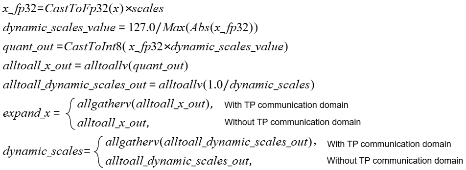

# torch\_npu.npu\_moe\_distribute\_dispatch<a name="en-us_topic_0000002343094193"></a>

## Supported Products

| Product                                                        | Supported|
| ------------------------------------------------------------ | :------: |
|<term>Atlas A3 training products/Atlas A3 inference products</term>          |    √     |
|<term>Atlas A2 training products/Atlas A2 inference products</term> | √   |

## Function<a name="en-us_topic_0000002203575833_section14441124184110"></a>

- Description: Performs quantization on token data (optional), followed by `alltoallv` communication in the Expert Parallelism (EP) domain, and then `allgatherv` communication in the Tensor Parallelism (TP) domain (optional). This API must be used together with [torch_npu.npu_moe_distribute_combine](torch_npu-npu_moe_distribute_combine.md) to implement token dispatch and combine for MoE parallel deployment.
- Formulas: ($x$ indicates the input `x`, $scales$ indicates the input `scales`, and $quant\_mode$ indicates the input `quant_mode`.)
    - When `quant_mode` is not `2` (non-dynamic quantization scenario):

        

    - When `quant_mode` is set to 2 (dynamic quantization scenario):

        

## Prototype<a name="en-us_topic_0000002203575833_section45077510411"></a>

```python
torch_npu.npu_moe_distribute_dispatch(x, expert_ids, group_ep, ep_world_size, ep_rank_id, moe_expert_num, *, scales=None, x_active_mask=None, expert_scales=None, group_tp="", tp_world_size=0, tp_rank_id=0, expert_shard_type=0, shared_expert_num=1, shared_expert_rank_num=0, quant_mode=0, global_bs=0, expert_token_nums_type=1) -> (Tensor, Tensor, Tensor, Tensor, Tensor, Tensor, Tensor)
```

## Parameters<a name="en-us_topic_0000002203575833_section112637109429"></a>

- **`x`** (`Tensor`): Token data used for computation and dispatched to other ranks based on `expert_ids`. This parameter must be 2D with shape `(BS, H)`, indicating that there are `BS` (batch size) tokens. The data type can be `bfloat16` or `float16`. The data layout is ND. Non-contiguous tensors are supported.
- **`expert_ids`** (`Tensor`): Top-K expert indices for each token, determining the experts to which each token is dispatched. This parameter must be 2D with shape `(BS, K)`. The data type can be `int32`. The data layout is ND. Non-contiguous tensors are supported. This parameter corresponds to the `expert_ids` input of [torch_npu.npu_moe_distribute_combine](torch_npu-npu_moe_distribute_combine.md). The value range of elements inside the tensor is [0, `moe_expert_num`), and the `K` values within the identical row must be unique.
- **`group_ep`** (`str`): EP communication domain name used for expert parallelism. The string length range is [1, 128). On <term>Atlas A3 training products/Atlas A3 inference products</term>, the value of this parameter must differ from `group_tp`.
- **`ep_world_size`** (`int`): Size of the EP communication domain.
    - <term>Atlas A2 training products/Atlas A2 inference products</term>: Valid values are `16`, `32`, or `64`.
    - <term>Atlas A3 training products/Atlas A3 inference products</term>: Valid values are `8`, `16`, `32`, `64`, `128`, `144`, `256`, or `288`.

- **`ep_rank_id`** (`int`): Rank ID of the current rank within the EP communication domain. The value range is [0, `ep_world_size`). The `ep_rank_id` values of all ranks within the identical EP communication domain must be unique.
- **`moe_expert_num`** (`int`): Number of MoE experts. The value range is [1, 512], and the condition `moe_expert_num % (ep_world_size - shared_expert_rank_num) == 0` must be satisfied.
    - <term>Atlas A2 training products/Atlas A2 inference products</term>: The following condition must also be met: `moe_expert_num/(ep_world_size - shared_expert_rank_num) <= 24`.
- **`*`**: Required. Positional argument separator. Arguments before this symbol are positional-only and must be passed in sequence. Arguments after this symbol are keyword-only, position-independent options that require key-value assignments (default values are used if no value is assigned).
- **`scales`** (`Tensor`): Optional. Weight of each expert. This parameter is currently not used in non-quantization scenarios. In dynamic quantization scenarios, it can be provided or omitted. If provided, it must be a 2D tensor. When shared experts are present, the shape is `(shared_expert_num + moe_expert_num, H)`. When no shared experts are present, the shape is `(moe_expert_num, H)`. The data type can be `float`. The data layout is ND. Non-contiguous tensors are not supported.
- **`x_active_mask`** (`Tensor`): Reserved parameter, currently not used. Retain the default value.

- **`expert_scales`** (`Tensor`): Optional. Top-K expert weights for each token.
    - <term>Atlas A2 training products/Atlas A2 inference products</term>: This parameter must be 2D with shape `(BS, K)`. The data type can be `float`. The data layout is ND. Non-contiguous tensors are supported.
    - <term>Atlas A3 training products/Atlas A3 inference products</term>: Currently, this parameter is not supported. Retain the default value.

- **`group_tp`** (`str`): Optional. Communication domain name used for tensor parallelism. This parameter is required when there is TP domain communication. Otherwise, use the default value `""`.
    - <term>Atlas A2 training products/Atlas A2 inference products</term>: In eager mode, use the default value. In graph mode, the value must be identical to that of `group_ep`.
    - <term>Atlas A3 training products/Atlas A3 inference products</term>: The string length value range is [0, 128). The value of this parameter must differ from `group_ep`. An empty value is supported only when there is no TP domain.

- **`tp_world_size`** (`int`): Optional. Size of the TP communication domain. This parameter is required only when TP domain communication is involved.
    - <term>Atlas A2 training products/Atlas A2 inference products</term>: TP domain communication is not supported. Use the default value `0`.
    - <term>Atlas A3 training products/Atlas A3 inference products</term>: When TP domain communication is involved, the value range is [0, 2]. The values `0` and `1` indicate that there is no TP domain communication, and the value `2` indicates that there is TP domain communication.

- **`tp_rank_id`** (`int`): Optional. Rank ID of the current rank within the TP communication domain. This parameter is required only when TP domain communication is involved.
    - <term>Atlas A2 training products/Atlas A2 inference products</term>: TP domain communication is not supported. Use the default value.
    - <term>Atlas A3 training products/Atlas A3 inference products</term>: When TP domain communication is involved, the value range is [0, 1]. The default value is `0`. The `tp_rank_id` of each rank in the same TP communication domain must be unique. If there is no TP domain communication, pass `0`.

- **`expert_shard_type`** (`int`): Layout type of shared-expert ranks.
    - <term>Atlas A2 training products/Atlas A2 inference products</term>: Currently, this parameter is not supported. Retain the default value.
    - <term>Atlas A3 training products/Atlas A3 inference products</term>: Currently, only `0` is supported, indicating that shared-expert ranks are arranged in front of MoE expert ranks.
- **`shared_expert_num`** (`int`): Number of shared experts, where a shared expert can be replicated and deployed across multiple ranks.
    - <term>Atlas A2 training products/Atlas A2 inference products</term>: Currently, this parameter is not supported. Retain the default value.
    - <term>Atlas A3 training products/Atlas A3 inference products</term>: Only the default value `1` is supported.

- **`shared_expert_rank_num`** (`int`): Optional. Number of shared-expert ranks.
    - <term>Atlas A2 training products/Atlas A2 inference products</term>: Shared experts are not supported. Set it to `0`.
    - <term>Atlas A3 training products/Atlas A3 inference products</term>: The value range is [0, `ep_world_size`). The value `0` indicates that no shared experts are used. If the value is not `0`, the condition `ep_world_size % shared_expert_rank_num == 0` must be satisfied.

- **`quant_mode`** (`int`): Optional. Quantization mode. Valid values are `0` (non-quantization mode, default) or `2` (dynamic quantization mode). When the value of `quant_mode` is 2, `dynamic_scales` must not be `None`. When the value of `quant_mode` is `0`, `dynamic_scales` must be `None`.
- **`global_bs`** (`int`): Optional. Global batch size within the EP communication domain.
    - <term>Atlas A2 training products/Atlas A2 inference products</term>: When the batch sizes differ across ranks, passing `max_bs * ep_world_size` or `256 * ep_world_size` is supported, where `max_bs` indicates the maximum batch size of a single rank. Passing `max_bs * ep_world_size` is recommended. Consistently passing `256 * ep_world_size` will result in a lack of support in future versions for scenarios where the batch size is greater than 256. When the batch sizes are identical across ranks, passing `0` or `BS * ep_world_size` is supported.
    - <term>Atlas A3 training products/Atlas A3 inference products</term>: When the batch sizes differ across ranks, passing `max_bs * ep_world_size` is supported, where `max_bs` indicates the maximum batch size of a single rank. When the batch sizes are identical across ranks, passing `0` or `BS * ep_world_size` is supported.

- **`expert_token_nums_type`** (`int`): Optional. Value type of the output `expert_token_nums`. Valid values are `0` or `1`. The value `0` outputs the prefix sums of the numbers of tokens received by each expert, and `1` outputs numbers of tokens received by each expert (default).

## Return Values<a name="en-us_topic_0000002203575833_section22231435517"></a>

- **`expand_x`** (`Tensor`): Token data received by the current rank. It must be 2D with shape `(max(tp_world_size, 1) * A, H)`. `A` represents the maximum number of tokens that can be received in the EP communication domain. The data type can be `bfloat16`, `float16`, or `int8`. The data type must be `int8` during quantization. The data type must be identical to that of `x` in non-quantization scenarios. The data format is ND. Non-contiguous tensors are supported. The data layout is ND. Non-contiguous tensors are supported.
- **`dynamic_scales`** (`Tensor`): Dynamically quantized parameters obtained through computation. This output is available only when `quant_mode` is not `0`. This parameter must be 1D with shape `(A,)`. The data type can be `float`. The data layout can be ND. Non-contiguous tensors are supported.
- **`expand_idx`** (`Tensor`): Number of tokens sent to the same expert. This parameter must be 1D with shape `(BS * K,)`. The data type can be `int32`. The data layout is ND. Non-contiguous tensors are supported. This parameter corresponds to the `expand_idx` input of [torch_npu.npu_moe_distribute_combine](torch_npu-npu_moe_distribute_combine.md).

- **`expert_token_nums`** (`Tensor`): Number of tokens received by each expert on the current rank. It must be 1D with shape `(local_expert_num,)`. The data type can be `int64`. The data layout can be ND. Non-contiguous tensors are supported.
- **`ep_recv_counts`** (`Tensor`): Number of tokens (represented as a prefix sum) received by each rank in the EP communication domain. This parameter must be a 1D tensor. The data type is `int32`. The data layout can be ND. Non-contiguous tensors are supported. This parameter corresponds to the `ep_send_counts` input of [torch_npu.npu_moe_distribute_combine](torch_npu-npu_moe_distribute_combine.md).
    - <term>Atlas A2 training products/Atlas A2 inference products</term>: The shape must be `(moe_expert_num + 2 * global_bs * K * server_num,)`. The first `moe_expert_num` elements indicate the token counts received by each expert on the current rank from other ranks within the EP communication domain, represented as prefix sums. The remaining `2 * global_bs * K * server_num` elements are used to store the token counts that can be reduced in advance during the combine operation and the communication buffer offsets before executing inter-server and intra-server communication. When the value of `global_bs` is `0`, the value is calculated as `bs * ep_world_size`.
    - <term>Atlas A3 training products/Atlas A3 inference products</term>: The shape must be `(ep_world_size * max(tp_world_size, 1) * local_expert_num,)`.

- **`tp_recv_counts`** (`Tensor`): Number of tokens received by each rank in the TP communication domain. This parameter corresponds to the `tp_send_counts` input of [torch_npu.npu_moe_distribute_combine](torch_npu-npu_moe_distribute_combine.md).
    - <term>Atlas A2 training products/Atlas A2 inference products</term>: The TP communication domain is not supported. This output is not available.
    - <term>Atlas A3 training products/Atlas A3 inference products</term>: The TP communication domain is supported. This parameter must be 1D with shape `(tp_world_size,)`. The data type can be `int32`. The data layout is ND. Non-contiguous tensors are supported.

- **`expand_scales`** (`Tensor`): Output after the alltoallv operation is performed on `expert_scales` and `x`.
    - <term>Atlas A2 training products/Atlas A2 inference products</term>: This parameter must be 1D with shape `(A,)`. The data type can be `float`. The data layout must be ND. Non-contiguous tensors are supported.
    - <term>Atlas A3 training products/Atlas A3 inference products</term>: This output is not supported. `None` is returned.

## Constraints<a name="en-us_topic_0000002203575833_section12345537164214"></a>

- This API can be used in inference scenarios.
- This API supports static graph mode. `npu_moe_distribute_dispatch` and `npu_moe_distribute_combine` must be used in combination.
- Element values inside the `expand_idx`, `ep_recv_counts`, `tp_recv_counts`, and `expand_scales` tensors output by `npu_moe_distribute_dispatch` can vary across different product models, communication algorithms, or software versions. When using this API, pass these tensors directly to the corresponding parameters of `npu_moe_distribute_combine`. Other service logic of the model must not depend on them.
- Values of the `group_ep`, `ep_world_size`, `moe_expert_num`, `group_tp`, `tp_world_size`, `expert_shard_type`, `shared_expert_num`, `shared_expert_rank_num`, and `global_bs` parameters must remain identical across all ranks during the API call process. In addition, the values of `group_ep`, `ep_world_size`, `moe_expert_num`, `group_tp`, `tp_world_size`, `expert_shard_type`, and `global_bs` must also remain identical across different layers in the network and must match the corresponding parameters in [torch_npu.npu_moe_distribute_combine](torch_npu-npu_moe_distribute_combine.md).
- <term>Atlas A3 training products/Atlas A3 inference products</term>: In this scenario, a single rank contains dual dies. Therefore, "this rank" in the parameter description indicates a single die.
- Variables used in parameter tensor shapes:
    - `A`: Maximum number of tokens that can be received by the current rank. The value range is as follows:
        - For shared experts, when `global_bs` is `0`: `A=BS*shared_expert_num/shared_expert_rank_num`. When `global_bs` is not `0`: `A=global_bs*shared_expert_num/shared_expert_rank_num`.
        - For MoE experts, when `global_bs` is `0`: `A >= BS * ep_world_size * min(local_expert_num, K)`. When `global_bs` is not `0`: `A >= global_bs * min(local_expert_num, K)`.

    - `H`: Hidden layer size.
        - <term>Atlas A2 training products/Atlas A2 inference products</term>: The value range is (0, 7168], and the value must be an integer multiple of 32.
        - <term>Atlas A3 training products/Atlas A3 inference products</term>: Only the value `7168` is supported.

    - `BS`: Number of tokens to be sent.
        - <term>Atlas A2 training products/Atlas A2 inference products</term>: The value range is 0 < `BS` <= 256.
        - <term>Atlas A3 training products/Atlas A3 inference products</term>: The value range is 0 < `BS` <= 512.

    - `K`: Number of top-K experts selected. The value range is 0 < `K` ≤ `moe_expert_num`.
        - <term>Atlas A2 training products/Atlas A2 inference products</term>: The value range is 0 < `K` <= 16.
        - <term>Atlas A3 training products/Atlas A3 inference products</term>: The value range is 0 < `K` <= 8.

    - `server_num`: Number of server nodes. Valid values are `2`, `4`, or `8`.
        - <term>Atlas A2 training products/Atlas A2 inference products</term>: This variable is used only in shapes for this scenario.

    - `local_expert_num`: Number of experts on the current rank.
        - For shared-expert ranks, `local_expert_num = 1`.
        - For MoE expert ranks, `local_expert_num = moe_expert_num/(ep_world_size - shared_expert_rank_num)`. When `local_expert_num > 1`, communication in the TP domain is not supported.

- HCCL communication domain buffer size:

    Before calling this API, verify that the configured HCCL communication domain buffer size is reasonable. The unit is MB, and the default value is `200` MB if not configured.
    - <term>Atlas A2 training products/Atlas A2 inference products</term>:
        The buffer size can be configured using the `HCCL_BUFFSIZE` environment variable.
        - The value must be greater than or equal to `2 * (bs * ep_world_size * min(local_expert_num, K) * H * sizeof(uint16) + 2MB)`.
    - <term>Atlas A3 training products/Atlas A3 inference products</term>:
        The buffer size can be configured through either the `HCCL_BUFFSIZE` environment variable or the `hccl_buffer_size` parameter. For details, see section "hccl_buffer_size" in [PyTorch Training Model Porting and Tuning](https://hiascend.com/document/redirect/canncommercial-ptmigr) (path: **Performance Profiling** > **Performance Profiling Methods** > **Communication Optimization** > **Optimization Methods** > **hccl_buffer_size**).
        - Within the EP communication domain: The value must be greater than or equal to 2 and satisfy the condition `1024^2 * (HCCL_BUFFSIZE - 2) / 2 >= bs * 2 * (H + 128) * (ep_world_size * local_expert_num + K + 1)`. The parameter `local_expert_num` must be the number of experts on the current MoE expert rank.
        - Within the TP communication domain: The value must be grater than or equal to `A * (H * 2 + 128) * 2`.
- <term>Atlas A2 training products/Atlas A2 inference products</term>: Configuring the environment variables `HCCL_INTRA_PCIE_ENABLE=1` and `HCCL_INTRA_ROCE_ENABLE=0` can reduce the cross-server communication data volume and improve operator performance. In this case, the condition `HCCL_BUFFSIZE >= moe_expert_num * bs * (H * sizeof(dtype_x) + 4 * ((K + 7) / 8 * 8) * sizeof(uint32)) + 4MB + 100MB` must be satisfied. Furthermore, for the input parameter `moe_expert_num`, only the condition `moe_expert_num % (ep_world_size - shared_expert_rank_num) == 0` must be satisfied, and the condition `moe_expert_num / (ep_world_size - shared_expert_rank_num) <= 24` is not required.

- In formulas in this document, the division sign (/) indicates integer division.

- Communication domain usage constraints:

    - The `npu_moe_distribute_dispatch` and `npu_moe_distribute_combine` operators within a single model must operate in the same EP communication domain, which must not include other operators.

    - The `npu_moe_distribute_dispatch` and `npu_moe_distribute_combine` operators within a single model must either operate in the same TP communication domain or both operate without a TP communication domain. When a TP communication domain is involved, this domain must not include other operators.

    - <term>Atlas A3 training products/Atlas A3 inference products</term>: Nodes in a communication domain must reside within the same SuperPoD. Cross-SuperPoD deployment is not supported.

- Networking constraints:
    - <term>Atlas A2 training products/Atlas A2 inference products</term>: In multi-server deployments, only switch-based networking is supported. Direct connections between two servers are not supported.

- Version mapping constraints:

     In static graph mode, starting with Ascend Extension for PyTorch 8.0.0, the Ascend Extension for PyTorch framework performs strict validation between the Meta inference results and inferShape inference results of the output of the last node in the static graph. If the graph contains only one Dispatch operator and the CANN version is earlier than the Ascend Extension for PyTorch version, a shape mismatch error may occur. You are advised to upgrade the CANN version. For details about version compatibility information, see section **Related Product Versions** in the [Ascend Extension for PyTorch Release Notes](https://gitcode.com/Ascend/pytorch/blob/v2.7.1/docs/zh/release_notes/release_notes.md).

## Examples<a name="en-us_topic_0000002203575833_section14459801435"></a>

- Single-operator call

    ```python
    import os
    import torch
    import random
    import torch_npu
    import numpy as np
    from torch.multiprocessing import Process
    import torch.distributed as dist
    from torch.distributed import ReduceOp

    # Control mode
    quant_mode = 2                       # 2 indicates dynamic quantization
    is_dispatch_scales = True            # For dynamic quantization, you can choose whether to pass scales
    input_dtype = torch.bfloat16         # Output data type
    server_num = 1
    server_index = 0
    port = 50001
    master_ip = '127.0.0.1'
    dev_num = 16
    world_size = server_num * dev_num
    rank_per_dev = int(world_size / server_num)  # Number of dies per host
    sharedExpertRankNum = 2                      # Number of shared experts
    moeExpertNum = 14                            # Number of MOE experts
    bs = 8                                       # Number of tokens
    h = 7168                                     # Length of each token
    k = 8
    random_seed = 0
    tp_world_size = 1
    ep_world_size = int(world_size / tp_world_size)
    moe_rank_num = ep_world_size - sharedExpertRankNum
    local_moe_expert_num = moeExpertNum // moe_rank_num
    globalBS = bs * ep_world_size
    is_shared = (sharedExpertRankNum > 0)
    is_quant = (quant_mode > 0)

    def gen_unique_topk_array(low, high, bs, k):
        array = []
        for i in range(bs):
            top_idx = list(np.arange(low, high, dtype=np.int32))
            random.shuffle(top_idx)
            array.append(top_idx[0:k])
        return np.array(array)

    def get_new_group(rank):
        for i in range(tp_world_size):
            # Result when tp_world_size = 2 and ep_world_size = 8: [[0, 2, 4, 6, 8, 10, 12, 14], [1, 3, 5, 7, 9, 11, 13, 15]]
            ep_ranks = [x * tp_world_size + i for x in range(ep_world_size)]
            ep_group = dist.new_group(backend="hccl", ranks=ep_ranks)
            if rank in ep_ranks:
                ep_group_t = ep_group
                print(f"rank:{rank} ep_ranks:{ep_ranks}")
        for i in range(ep_world_size):
            # Result when tp_world_size = 2 and ep_world_size = 8: [[0, 1], [2, 3], [4, 5], [6, 7], [8, 9], [10, 11], [12, 13], [14, 15]]
            tp_ranks = [x + tp_world_size * i for x in range(tp_world_size)]
            tp_group = dist.new_group(backend="hccl", ranks=tp_ranks)
            if rank in tp_ranks:
                tp_group_t = tp_group
                print(f"rank:{rank} tp_ranks:{tp_ranks}")
        return ep_group_t, tp_group_t

    def get_hcomm_info(rank, comm_group):
        if torch.__version__ > '2.0.1':
            hcomm_info = comm_group._get_backend(torch.device("npu")).get_hccl_comm_name(rank)
        else:
            hcomm_info = comm_group.get_hccl_comm_name(rank)
        return hcomm_info

    def run_npu_process(rank):
        torch_npu.npu.set_device(rank)
        rank = rank + 16 * server_index
        dist.init_process_group(backend='hccl', rank=rank, world_size=world_size, init_method=f'tcp://{master_ip}:{port}')
        ep_group, tp_group = get_new_group(rank)
        ep_hcomm_info = get_hcomm_info(rank, ep_group)
        tp_hcomm_info = get_hcomm_info(rank, tp_group)

        # Create input tensors
        x = torch.randn(bs, h, dtype=input_dtype).npu()
        expert_ids = gen_unique_topk_array(0, moeExpertNum, bs, k).astype(np.int32)
        expert_ids = torch.from_numpy(expert_ids).npu()

        expert_scales = torch.randn(bs, k, dtype=torch.float32).npu()
        scales_shape = (1 + moeExpertNum, h) if sharedExpertRankNum else (moeExpertNum, h)
        if is_dispatch_scales:
            scales = torch.randn(scales_shape, dtype=torch.float32).npu()
        else:
            scales = None

        expand_x, dynamic_scales, expand_idx, expert_token_nums, ep_recv_counts, tp_recv_counts, expand_scales = torch_npu.npu_moe_distribute_dispatch(
            x=x,
            expert_ids=expert_ids,
            group_ep=ep_hcomm_info,
            group_tp=tp_hcomm_info,
            ep_world_size=ep_world_size,
            tp_world_size=tp_world_size,
            ep_rank_id=rank // tp_world_size,
            tp_rank_id=rank % tp_world_size,
            expert_shard_type=0,
            shared_expert_rank_num=sharedExpertRankNum,
            moe_expert_num=moeExpertNum,
            scales=scales,
            quant_mode=quant_mode,
            global_bs=globalBS)
        if is_quant:
            expand_x = expand_x.to(input_dtype)
        x = torch_npu.npu_moe_distribute_combine(expand_x=expand_x,
                                                 expert_ids=expert_ids,
                                                 expand_idx=expand_idx,
                                                 ep_send_counts=ep_recv_counts,
                                                 tp_send_counts=tp_recv_counts,
                                                 expert_scales=expert_scales,
                                                 group_ep=ep_hcomm_info,
                                                 group_tp=tp_hcomm_info,
                                                 ep_world_size=ep_world_size,
                                                 tp_world_size=tp_world_size,
                                                 ep_rank_id=rank // tp_world_size,
                                                 tp_rank_id=rank % tp_world_size,
                                                 expert_shard_type=0,
                                                 shared_expert_rank_num=sharedExpertRankNum,
                                                 moe_expert_num=moeExpertNum,
                                                 global_bs=globalBS)
        print(f'rank {rank} epid {rank // tp_world_size} tpid {rank % tp_world_size} npu finished! \n')

    if __name__ == "__main__":
        print(f"bs={bs}")
        print(f"global_bs={globalBS}")
        print(f"shared_expert_rank_num={sharedExpertRankNum}")
        print(f"moe_expert_num={moeExpertNum}")
        print(f"k={k}")
        print(f"quant_mode={quant_mode}", flush=True)
        print(f"local_moe_expert_num={local_moe_expert_num}", flush=True)
        print(f"tp_world_size={tp_world_size}", flush=True)
        print(f"ep_world_size={ep_world_size}", flush=True)

        if tp_world_size != 1 and local_moe_expert_num > 1:
            print("unSupported tp = 2 and local moe > 1")
            exit(0)

        if sharedExpertRankNum > ep_world_size:
            print("sharedExpertRankNum cannot be greater than ep_world_size")
            exit(0)

        if sharedExpertRankNum > 0 and ep_world_size % sharedExpertRankNum != 0:
            print("ep_world_size must be an integer multiple of sharedExpertRankNum")
            exit(0)

        if moeExpertNum % moe_rank_num != 0:
            print("moeExpertNum must be an integer multiple of moe_rank_num")
            exit(0)

        p_list = []
        for rank in range(rank_per_dev):
            p = Process(target=run_npu_process, args=(rank,))
            p_list.append(p)
        for p in p_list:
            p.start()
        for p in p_list:
            p.join()
        print("run npu success.")

    ```

- Graph mode call

    ```python
    # Only static graphs are supported
    import os
    import torch
    import random
    import torch_npu
    import torchair
    import numpy as np
    from torch.multiprocessing import Process
    import torch.distributed as dist
    from torch.distributed import ReduceOp

    # Control mode
    quant_mode = 2                         # 2 indicates dynamic quantization
    is_dispatch_scales = True              # For dynamic quantization, you can choose whether to pass scales
    input_dtype = torch.bfloat16           # Output data type
    server_num = 1
    server_index = 0
    port = 50001
    master_ip = '127.0.0.1'
    dev_num = 16
    world_size = server_num * dev_num
    rank_per_dev = int(world_size / server_num)  # Number of dies per host
    sharedExpertRankNum = 2                      # Number of shared experts
    moeExpertNum = 14                            # Number of MOE experts
    bs = 8                                       # Number of tokens
    h = 7168                                     # Length of each token
    k = 8
    random_seed = 0
    tp_world_size = 1
    ep_world_size = int(world_size / tp_world_size)
    moe_rank_num = ep_world_size - sharedExpertRankNum
    local_moe_expert_num = moeExpertNum // moe_rank_num
    globalBS = bs * ep_world_size
    is_shared = (sharedExpertRankNum > 0)
    is_quant = (quant_mode > 0)

    class MOE_DISTRIBUTE_GRAPH_Model(torch.nn.Module):
        def __init__(self):
            super().__init__()

        def forward(self, x, expert_ids, group_ep, group_tp, ep_world_size, tp_world_size,
                    ep_rank_id, tp_rank_id, expert_shard_type, shared_expert_rank_num, moe_expert_num,
                    scales, quant_mode, global_bs, expert_scales):
            output_dispatch_npu = torch_npu.npu_moe_distribute_dispatch(x=x,
                                                                        expert_ids=expert_ids,
                                                                        group_ep=group_ep,
                                                                        group_tp=group_tp,
                                                                        ep_world_size=ep_world_size,
                                                                        tp_world_size=tp_world_size,
                                                                        ep_rank_id=ep_rank_id,
                                                                        tp_rank_id=tp_rank_id,
                                                                        expert_shard_type=expert_shard_type,
                                                                        shared_expert_rank_num=shared_expert_rank_num,
                                                                        moe_expert_num=moe_expert_num,
                                                                        scales=scales,
                                                                        quant_mode=quant_mode,
                                                                        global_bs=global_bs)

            expand_x_npu, _, expand_idx_npu, _, ep_recv_counts_npu, tp_recv_counts_npu, expand_scales = output_dispatch_npu
            if expand_x_npu.dtype == torch.int8:
                expand_x_npu = expand_x_npu.to(input_dtype)
            output_combine_npu = torch_npu.npu_moe_distribute_combine(expand_x=expand_x_npu,
                                                                      expert_ids=expert_ids,
                                                                      expand_idx=expand_idx_npu,
                                                                      ep_send_counts=ep_recv_counts_npu,
                                                                      tp_send_counts=tp_recv_counts_npu,
                                                                      expert_scales=expert_scales,
                                                                      group_ep=group_ep,
                                                                      group_tp=group_tp,
                                                                      ep_world_size=ep_world_size,
                                                                      tp_world_size=tp_world_size,
                                                                      ep_rank_id=ep_rank_id,
                                                                      tp_rank_id=tp_rank_id,
                                                                      expert_shard_type=expert_shard_type,
                                                                      shared_expert_rank_num=shared_expert_rank_num,
                                                                      moe_expert_num=moe_expert_num,
                                                                      global_bs=global_bs)
            x = output_combine_npu
            x_combine_res = output_combine_npu
            return [x_combine_res, output_combine_npu]

    def gen_unique_topk_array(low, high, bs, k):
        array = []
        for i in range(bs):
            top_idx = list(np.arange(low, high, dtype=np.int32))
            random.shuffle(top_idx)
            array.append(top_idx[0:k])
        return np.array(array)


    def get_new_group(rank):
        for i in range(tp_world_size):
            ep_ranks = [x * tp_world_size + i for x in range(ep_world_size)]
            ep_group = dist.new_group(backend="hccl", ranks=ep_ranks)
            if rank in ep_ranks:
                ep_group_t = ep_group
                print(f"rank:{rank} ep_ranks:{ep_ranks}")
        for i in range(ep_world_size):
            tp_ranks = [x + tp_world_size * i for x in range(tp_world_size)]
            tp_group = dist.new_group(backend="hccl", ranks=tp_ranks)
            if rank in tp_ranks:
                tp_group_t = tp_group
                print(f"rank:{rank} tp_ranks:{tp_ranks}")
        return ep_group_t, tp_group_t

    def get_hcomm_info(rank, comm_group):
        if torch.__version__ > '2.0.1':
            hcomm_info = comm_group._get_backend(torch.device("npu")).get_hccl_comm_name(rank)
        else:
            hcomm_info = comm_group.get_hccl_comm_name(rank)
        return hcomm_info

    def run_npu_process(rank):
        torch_npu.npu.set_device(rank)
        rank = rank + 16 * server_index
        dist.init_process_group(backend='hccl', rank=rank, world_size=world_size, init_method=f'tcp://{master_ip}:{port}')
        ep_group, tp_group = get_new_group(rank)
        ep_hcomm_info = get_hcomm_info(rank, ep_group)
        tp_hcomm_info = get_hcomm_info(rank, tp_group)

        # Create input tensors
        x = torch.randn(bs, h, dtype=input_dtype).npu()
        expert_ids = gen_unique_topk_array(0, moeExpertNum, bs, k).astype(np.int32)
        expert_ids = torch.from_numpy(expert_ids).npu()

        expert_scales = torch.randn(bs, k, dtype=torch.float32).npu()
        scales_shape = (1 + moeExpertNum, h) if sharedExpertRankNum else (moeExpertNum, h)
        if is_dispatch_scales:
            scales = torch.randn(scales_shape, dtype=torch.float32).npu()
        else:
            scales = None

        model = MOE_DISTRIBUTE_GRAPH_Model()
        model = model.npu()
        npu_backend = torchair.get_npu_backend()
        model = torch.compile(model, backend=npu_backend, dynamic=False)
        output = model.forward(x, expert_ids, ep_hcomm_info, tp_hcomm_info, ep_world_size, tp_world_size,
                               rank // tp_world_size,rank % tp_world_size, 0, sharedExpertRankNum, moeExpertNum, scales,
                               quant_mode, globalBS, expert_scales)
        torch.npu.synchronize()
        print(f'rank {rank} epid {rank // tp_world_size} tpid {rank % tp_world_size} npu finished! \n')

    if __name__ == "__main__":
        print(f"bs={bs}")
        print(f"global_bs={globalBS}")
        print(f"shared_expert_rank_num={sharedExpertRankNum}")
        print(f"moe_expert_num={moeExpertNum}")
        print(f"k={k}")
        print(f"quant_mode={quant_mode}", flush=True)
        print(f"local_moe_expert_num={local_moe_expert_num}", flush=True)
        print(f"tp_world_size={tp_world_size}", flush=True)
        print(f"ep_world_size={ep_world_size}", flush=True)

        if tp_world_size != 1 and local_moe_expert_num > 1:
            print("unSupported tp = 2 and local moe > 1")
            exit(0)

        if sharedExpertRankNum > ep_world_size:
            print("sharedExpertRankNum cannot be greater than ep_world_size")
            exit(0)

        if sharedExpertRankNum > 0 and ep_world_size % sharedExpertRankNum != 0:
            print("ep_world_size must be an integer multiple of sharedExpertRankNum")
            exit(0)

        if moeExpertNum % moe_rank_num != 0:
            print("moeExpertNum must be an integer multiple of moe_rank_num")
            exit(0)

        p_list = []
        for rank in range(rank_per_dev):
            p = Process(target=run_npu_process, args=(rank,))
            p_list.append(p)
        for p in p_list:
            p.start()
        for p in p_list:
            p.join()
        print("run npu success.")
    ```
